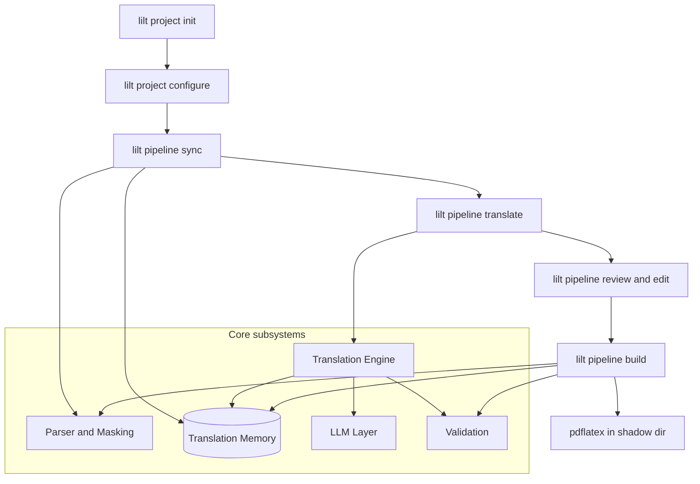
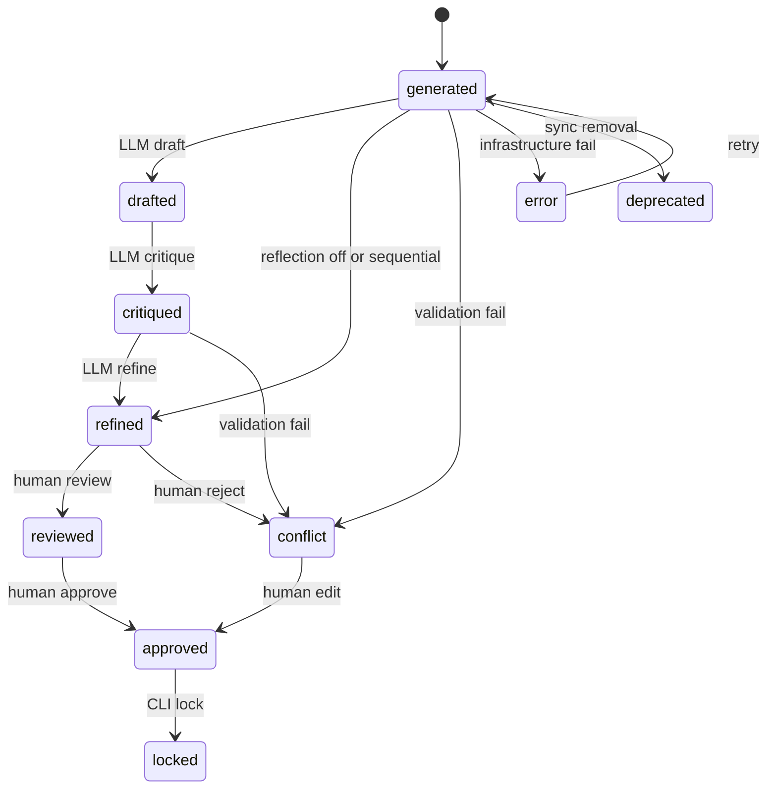

# LILT — LaTeX Intelligent Localization Tool

[](https://www.python.org/downloads/)
[](LICENSE)
[](#development)

LILT is a CLI for continuous localization of LaTeX projects. It parses documents into an Abstract Syntax Tree (AST), extracts translatable **segments**, masks structural LaTeX into **placeholders**, runs an LLM **reflection pipeline** (Draft → Critique → Refine), persists state in a **Translation Memory** (TM), and reconstructs translated `.tex` files for compilation.

---

## Table of Contents

- [Overview](#overview)
- [Features](#features)
- [Architecture Overview](#architecture-overview)
- [Installation](#installation)
- [Configuration](#configuration)
- [Quick Start](#quick-start)
- [CLI Reference](#cli-reference)
- [Typical Workflows](#typical-workflows)
- [Translation Workflow](#translation-workflow)
- [Project Structure](#project-structure)
- [Development](#development)
- [Testing](#testing)
- [Troubleshooting](#troubleshooting)
- [Performance Considerations](#performance-considerations)
- [Documentation Map](#documentation-map)
- [Contributing](#contributing)
- [License](#license)

---

## Overview

### Purpose

LILT treats LaTeX translation as a software engineering problem. Instead of sending raw `.tex` to an LLM, it:

1. Parses the document AST and splits it into stable **segments** with deterministic IDs.
2. Masks equations, macros, references, and verbatim blocks into placeholder tags.
3. Translates only linguistic prose through a multi-stage LLM pipeline.
4. Validates structural integrity before persisting translations.
5. Reconstructs the document by unmasking placeholders from persisted maps.

### Philosophy

| Principle | Meaning in LILT |
|-----------|-----------------|
| Integrity over linguistics | Placeholder and syntax validators run before a translation is accepted. |
| Human priority | Segments in `reviewed`, `approved`, or `locked` status are protected from automatic overwrite unless explicitly forced. |
| TM as source of truth | All segment state lives in append-only JSONL under `.lilt/tm/`. |
| Local-first LLM | Default configuration targets a local OpenAI-compatible endpoint; cloud models are optional per stage. |
| Reproducibility | Stable segment IDs, persisted placeholder maps, and checkpointed translation runs. |

### Scope

- **In scope:** Academic papers, books, technical manuals, and multi-file LaTeX projects with `\input{}`, custom macros, math, citations, and cross-references.
- **Out of scope:** OCR, diagram translation, WYSIWYG editing, remote Git automation (deferred).

### Maturity

LILT **0.1.0** is a **public beta** approaching 1.0. Core pipeline (sync, translate, build, review, TM management, telemetry) is implemented and tested. Phase 2 features (plugins, glossary validators, multi-language layout) are documented as deferred in [appendix-deferred](docs/architecture/appendix-deferred.md).

### Audience

| Persona | Use case |
|---------|----------|
| **Technical author** | Keep translations in sync when the source `.tex` changes. |
| **Technical translator** | Review machine output segment by segment with placeholder safety. |
| **Translation maintainer** | Resolve `conflict` segments after upstream edits; export/import for external review. |
| **Contributor** | Extend parsers, validators, or LLM providers via the service layer. |

---

## Features

### Parsing and AST Masking

- AST-based parsing via `pylatexenc` with gap-preserving roundtrip verification.
- Automatic discovery of unknown custom macros (`lilt project configure`).
- Dependency graph resolution: syncing `main.tex` crawls `\input{}` and `\usepackage{}` dependencies.
- Linguistic bypass: pure-math or placeholder-only segments skip the LLM.
- Opaque environment handling and configurable macro transparency.

### Placeholder Management

- Canonical placeholder format (`<macro id="N"/>`, `<math id="N"/>`, etc.).
- Persisted placeholder maps per segment in the TM.
- Build-time unmasking with drift detection (`BuildValidator`).
- Multiset-exact placeholder validation on every translation.

### LLM Reflection Pipeline

- Three-stage reflection: **Draft** → **Critique** → **Refine**.
- Critique outputs structured JSON (`requires_refine`, `issues`).
- Refine retries up to 3 times on validation failure.
- Optional reflection bypass when critique accepts the draft.

### Execution Modes

| Mode | Config key | Behavior |
|------|------------|----------|
| **Workflow** (default) | `translation_mode: workflow` | Breadth-first: all drafts, then critiques, then refines. |
| **Sequential** | `translation_mode: sequential` | Depth-first: full D→C→R per segment before the next. |

Override at runtime: `lilt pipeline translate --mode workflow|sequential`.

### Multi-Model Routing

- Single-provider, multi-model, and hybrid local/cloud topologies via `llm.stages`.
- Per-stage model, provider, `base_url`, and `api_key` overrides.
- `RouterLLMProvider` routes draft/critique/refine to different backends.

### Translation Memory

- Append-only JSONL per namespace under `.lilt/tm/`.
- 10-status segment lifecycle with transition policies.
- Identity resolution on sync (`SequenceMatcher` at configurable threshold).
- Source-change policy: human-protected segments become `conflict` when source changes.
- Import/export (CSV, JSON), list/search, status, admin prune/reset/repair.
- Single-writer session lock per namespace (`NamespaceBusyError` on conflict).

### Validation

- `PlaceholderValidator` — multiset-exact tag matching.
- `SyntaxValidator` — brace and structure delta checks.
- `SegmentTranslationValidator` — orchestrates placeholder + syntax for MT and human edits.
- `BuildValidator` — persisted vs. fresh placeholder map drift at build time.

### CLI

- Typer-based CLI with Rich output: `project`, `pipeline`, `tm`, `telemetry` command groups.
- Interactive review (`pipeline review`) and external-editor edit (`pipeline edit`).
- Global flags: `-C/--work-dir`, `-d/--debug`.

### Build and Reconstruction

- Re-parse source + stitch TM translations (never duplicate structure in TM).
- Whitespace shadowing from `raw_text` for byte-accurate output.
- Configurable preamble injections (`project.injections`).
- Shadow directory pattern for translated output (`i18n/build/`).

### Telemetry and Observability

- SQLite store at `.lilt/telemetry.db`.
- Per-request token counts, latency, model, stage, and bypass flags.
- `lilt telemetry show` and reflection cost estimation in `lilt tm status`.

---

## Architecture Overview

### Execution Flow



### Major Components

| Layer | Package | Responsibility |
|-------|---------|----------------|
| **CLI** | `lilt/cli/` | Typer commands, Rich UI, global options |
| **Services** | `lilt/services/` | `PipelineService`, `TMService`, `ProjectService`, workspace context |
| **Core** | `lilt/core/` | Sync, build, review policy, translation strategies |
| **Parser** | `lilt/parser/` | AST parse, masking, dependency resolution, roundtrip |
| **LLM** | `lilt/llm/` | Providers, factory, router, prompts, reflection passes |
| **TM** | `lilt/tm/` | JSONL repository, identity resolver, source-change policy, checkpoints |
| **Validation** | `lilt/validation/` | Placeholder, syntax, segment, and build validators |
| **Telemetry** | `lilt/telemetry/` | SQLite inference records and cost estimation |
| **Models** | `lilt/models/` | Pydantic domain models (segment, config, transitions) |

### Invariants

- One mutating operation per TM namespace at a time (session lock).
- Append-only TM writes during translation; compaction at stage end.
- `locked` and `deprecated` segments are immutable for automatic pipelines.
- Build uses persisted placeholder maps, not live parser state alone.
- Gap-preserving roundtrip is enforced at parse time.

### How AST Masking Works

The LLM never sees raw LaTeX structure. It sees masked prose with placeholder tags.

**1. Original source:**

```latex
The complexity is $\mathcal{O}(N \log N)$ as shown in \ref{fig:1}.
```

**2. Masked text sent to the LLM:**

```text
The complexity is <math id="1"/> as shown in <macro id="2"/>.
```

**3. Reconstructed translation (after unmasking):**

```latex
La complejidad es $\mathcal{O}(N \log N)$ como se muestra en \ref{fig:1}.
```

### Translation Modes

| | Workflow | Sequential |
|---|----------|------------|
| **Scheduling** | Breadth-first by stage | Depth-first per segment |
| **Context** | Bidirectional neighbors per stage | Backward-priority neighbors |
| **`--stage` flag** | Honored (`draft`, `critique`, `refine`) | Ignored (always full pipeline) |
| **Best for** | Batched GPU use, co-reference-heavy texts | Benchmarking, backward-refined context |

Configure default in `lilt.yaml`: `llm.translation_mode: workflow` or `sequential`.

---

## Installation

### Prerequisites

| Requirement | Required for | Notes |
|-------------|--------------|-------|
| **Python 3.13+** | All commands | Enforced in `pyproject.toml` |
| **uv** or **pipx** | Installation | `uv` is the project-standard tool |
| **TeX Live / MacTeX / MiKTeX** | Manual PDF compilation | Not required for sync/translate/build |
| **Git** | Recommended | TM JSONL files are version-control friendly |

### Global Install (recommended)

```bash
uv tool install git+https://github.com/aleaz/lilt
```

Or with pipx:

```bash
pipx install git+https://github.com/aleaz/lilt
```

### Editable Install from Source

```bash
git clone https://github.com/aleaz/lilt
cd lilt
uv sync
uv run lilt --help
```

### Development Install

```bash
git clone https://github.com/aleaz/lilt
cd lilt
uv sync          # installs runtime + dev dependencies
source .venv/bin/activate   # optional, for IDE integration
```

### Platform Notes

- **macOS / Linux:** Fully supported. File locks use `filelock` (POSIX-safe).
- **Windows:** Not explicitly tested; path handling uses `os.path` throughout.

---

## Configuration

### Workspace Layout

Running `lilt project init` creates:

```text
your-latex-project/
├── .lilt/
│   ├── lilt.yaml          # Main configuration (typed, validated)
│   ├── .env               # API keys (git-ignored)
│   ├── .gitignore         # Ignores *.db, .env, lilt.log
│   ├── tm/                # Translation Memory (JSONL per namespace)
│   │   ├── main.jsonl
│   │   └── chapters__intro.jsonl
│   ├── telemetry.db       # LLM inference telemetry (SQLite)
│   └── lilt.log           # Debug log (when .lilt exists)
├── main.tex
└── ...
```

Namespaces are derived from encoded relative `.tex` paths (e.g. `chapters/intro.tex` → `chapters__intro.jsonl`).

### Environment Variables

Loaded automatically from `.env` and `.lilt/.env` at CLI startup:

```bash
OPENAI_API_KEY=sk-...
```

Any OpenAI-compatible provider that needs a key can use `OPENAI_API_KEY` or per-stage `api_key` / `${VAR}` entries in `llm.stages`.

YAML supports `${VAR}` substitution via `yaml_loader` (unset variables fail fast).

### `lilt.yaml` Reference

Generated by `lilt project init`:

```yaml
project:
  source_lang: English
  target_lang: Spanish
  domain_context: ''        # Injected into LLM prompts for domain context
  injections: []            # LaTeX preamble lines injected at build time

review:
  queue_statuses:           # Segments eligible for `pipeline review`
    - refined
    - reviewed

llm:
  provider: openai          # Factory provider key (OpenAI-compatible API)
  model: local-model        # Base model; per-stage models fall back here
  draft_model: ''
  critique_model: ''
  refine_model: ''
  base_url: http://localhost:1234/v1
  temperature: 0.3          # Draft phase creativity
  reflection_temperature: 0.0   # Critique and Refine (deterministic)
  max_tokens: 8192
  model_context_limit: 8192
  timeout: 600.0
  draft_empty_retries: 1   # Fast-fail on empty draft output (increase to retry)
  context_window: 3         # Neighbor segments for context (int or per-stage dict)
  translation_mode: workflow
  token_price_per_million: 5.0
  retry:
    max_attempts: 3
    min_wait_seconds: 2
    max_wait_seconds: 60

parser:
  custom_macros: []         # Populated by `lilt project configure`
  identity:
    similarity_threshold: 0.85   # Carry-over threshold on source change
  block_transparent_macros:   # Macros whose arguments are not masked
    - section
    - subsection
    - title
    # ... (see init template for full list)
```

#### Advanced LLM Options (uncomment in init comments)

```yaml
llm:
  reflection_enabled: true
  prompt_dir: src/lilt/prompts    # Override Jinja templates
  stages:
    draft:
      model: local-model
    critique:
      provider: openai
      base_url: https://api.openai.com/v1
      api_key: sk-proj-...
      model: gpt-4o
    refine:
      model: gpt-4o-mini
  context_window:
    draft: 3
    critique: 3
    refine: 3
```

#### Advanced Parser Options

```yaml
parser:
  protected_terms: []         # Terms masked verbatim (e.g. brand names)
  opaque_environments: []     # Environments treated as opaque blocks
  inline_transparent_macros: []
  environment_aliases: {}
  max_segment_chars: null     # Split oversized segments
```

### LLM Topologies

**Single provider:**

```yaml
llm:
  provider: openai
  base_url: http://localhost:11434/v1
  model: qwen2.5:72b
```

**Multi-model (same provider):**

```yaml
llm:
  provider: openai
  base_url: http://localhost:1234/v1
  model: qwen2.5:72b
  stages:
    draft:
      model: qwen2.5:72b
    critique:
      model: llama3:8b
```

**Hybrid local/cloud:**

```yaml
llm:
  provider: openai
  base_url: http://localhost:11434/v1
  model: qwen2.5:72b
  stages:
    draft:
      model: qwen2.5:72b
    critique:
      provider: openai
      base_url: https://api.openai.com/v1
      api_key: sk-proj-...
      model: gpt-4o
    refine:
      provider: openai
      base_url: https://api.openai.com/v1
      api_key: sk-proj-...
      model: gpt-4o-mini
```

---

## Quick Start

From your LaTeX project directory:

```bash
# 1. Initialize workspace
lilt project init

# 2. Discover custom macros (optional but recommended)
lilt project configure .

# 3. Parse source and populate Translation Memory
lilt pipeline sync main.tex

# 4. Translate all namespaces
lilt pipeline translate --all

# 5. Build translated output into a shadow directory
mkdir -p i18n/build
lilt pipeline build main main.tex i18n/build/main.tex
```

Review and approve translations:

```bash
lilt pipeline review main
```

---

## CLI Reference

Global options (all commands):

| Flag | Description |
|------|-------------|
| `-C, --work-dir PATH` | Project directory (default: `.`) |
| `-d, --debug` | Enable debug logging to stdout and `.lilt/lilt.log` |

---

### `lilt project`

#### `project init`

Initialize LILT in the current directory. Creates `.lilt/lilt.yaml`, `.lilt/.env`, and `.lilt/.gitignore`.

```bash
lilt project init
```

#### `project configure`

Scan LaTeX files and register discovered macros/environment aliases in `lilt.yaml`.

```bash
lilt project configure [PATH] [--macros/--no-macros] [--include-aliases] [--dry-run] [--known] [--gaps]
```

| Option | Default | Description |
|--------|---------|-------------|
| `PATH` | `.` | File or directory to scan |
| `--macros/--no-macros` | `--macros` | Register unknown macros |
| `--include-aliases` | off | Register inferred environment aliases |
| `--dry-run` | off | Analyze and report without modifying `lilt.yaml` |
| `--known` | off | With `--dry-run`: also show macros already known to pylatexenc |
| `--gaps` | off | With `--dry-run`: show syntax gaps detected in the source |

---

### `lilt pipeline`

#### `pipeline sync`

Parse a LaTeX file and sync segments to the TM. Auto-discovers `\input{}` dependencies.

```bash
lilt pipeline sync INPUT_FILE
```

#### `pipeline translate`

Run the LLM translation pipeline on one or all namespaces.

```bash
lilt pipeline translate [NAMESPACE] [OPTIONS]
```

| Option | Description |
|--------|-------------|
| `--all, -a` | Translate all namespaces |
| `--status, -s STATUS` | Filter by segment status |
| `--force, -f` | Re-translate eligible segments (archives prior translation) |
| `--id SEGMENT_ID` | Translate a single segment prefix |
| `--stage STAGE` | Workflow only: `draft`, `critique`, or `refine` |
| `--mode MODE` | Override `translation_mode`: `workflow` or `sequential` |

Examples:

```bash
lilt pipeline translate main
lilt pipeline translate --all
lilt pipeline translate main --stage draft
lilt pipeline translate main --status generated --force
lilt pipeline translate main --mode sequential
```

#### `pipeline build`

Reconstruct a translated `.tex` file from the TM.

```bash
lilt pipeline build NAMESPACE INPUT_FILE OUTPUT_FILE
```

#### `pipeline review`

Interactive review queue for segments matching `review.queue_statuses`.

```bash
lilt pipeline review NAMESPACE
```

Prompts: `[a]pprove`, `[e]dit`, `[r]eject`, `[s]kip`, `[q]uit`.

#### `pipeline edit`

Open a segment translation in `$EDITOR`. Saves and approves on success.

```bash
lilt pipeline edit NAMESPACE SEGMENT_ID
```

---

### `lilt tm`

#### `tm list`

List namespaces (no args), list segments in a namespace, search text, or inspect one segment.

```bash
lilt tm list [NAMESPACE] [--status STATUS] [--search QUERY] [--all] [--id SEGMENT_ID]
```

| Option | Description |
|--------|-------------|
| (no args) | List namespaces with summary stats |
| `NAMESPACE` | List segments in that namespace |
| `--all, -a` | List segments across all namespaces |
| `--status` | Filter by segment status |
| `--search` | Filter by substring in source or translation |
| `--id` | Inspect a specific segment (requires `NAMESPACE`) |

#### `tm status`

Translation progress and token/cost metrics per namespace.

```bash
lilt tm status [NAMESPACE] [--all]
```

#### `tm set-status`

Explicitly change a segment lifecycle status.

```bash
lilt tm set-status NAMESPACE SEGMENT_ID STATUS [--force]
```

`--force` allows reset to `GENERATED` (clears translation and LLM artifacts) and modifications to `locked` segments.

#### `tm export`

Export active segments to CSV or JSON.

```bash
lilt tm export NAMESPACE OUTPUT_FILE [--format csv|json]
```

#### `tm import`

Import translations from CSV or JSON. Updates segments to `reviewed` on translation change.

```bash
lilt tm import NAMESPACE INPUT_FILE [--format csv|json]
```

#### `tm admin prune`

Permanently remove `deprecated` segments from a namespace.

```bash
lilt tm admin prune NAMESPACE
```

#### `tm admin repair`

Skip corrupt JSONL lines, backup the original file, and compact the namespace.

```bash
lilt tm admin repair NAMESPACE [--dry-run]
```

#### `tm admin reset`

Reset machine-translated segments to `generated`. With `--force`, also resets `reviewed` and `approved`.

```bash
lilt tm admin reset NAMESPACE [--force]
```

---

### `lilt telemetry`

#### `telemetry show`

Display LLM inference records (tokens, latency, model, stage).

```bash
lilt telemetry show [--namespace NS]
```

---

## Typical Workflows

### 1. Initialize a New Workspace

```bash
cd my-paper/
git init                    # recommended
lilt project init
lilt project configure .
# Edit .lilt/lilt.yaml: set target_lang, base_url, model
# Edit .lilt/.env: set OPENAI_API_KEY if using cloud models
```

### 2. Translate a Project

```bash
lilt pipeline sync main.tex          # crawls \input{} dependencies
lilt pipeline translate --all
lilt pipeline review main            # human approval loop
mkdir -p i18n/build
lilt pipeline build main main.tex i18n/build/main.tex
```

### 3. Resume After Interruption

Translation checkpoints append each segment to JSONL during a run. If the process is interrupted (`Ctrl+C`), completed segments are persisted. Re-run:

```bash
lilt pipeline translate --all
```

Only `generated` and `error` segments are picked up by default. Use `--force` to re-translate specific segments.

### 4. Manage TM Conflicts

When source text changes on a human-protected segment, sync marks it `conflict`:

```bash
lilt pipeline sync main.tex          # reports new conflicts
lilt tm list main --status conflict
lilt pipeline edit main <segment_id> # resolve manually
# Or reject in review:
lilt pipeline review main
```

### 5. Human Review and Inspection

```bash
lilt tm status main
lilt tm list main --id abc12345
lilt pipeline review main
lilt pipeline edit main abc12345
```

### 6. External Review (Export / Import)

```bash
lilt tm export main review.csv
# Human edits review.csv externally
lilt tm import main review.csv
```

Import updates translations and sets status to `reviewed`. Locked and deprecated segments are skipped.

---

## Translation Workflow

### Reflection Stages

| Stage | Input | Output | Segment status |
|-------|-------|--------|----------------|
| **Draft** | Masked source + context | Draft text | `drafted` (reflection on) or `refined` (reflection off) |
| **Critique** | Draft + source | Structured critique JSON | `critiqued` |
| **Refine** | Draft + critique + source | Validated translation | `refined` |

When `llm.reflection_enabled: false`, draft is validated and accepted directly as `refined`.

### Segment Lifecycle



| Status | Meaning |
|--------|---------|
| `generated` | Parsed, no translation yet |
| `drafted` | LLM draft stored; translation empty (reflection on) |
| `critiqued` | Critique artifact stored |
| `refined` | Machine translation complete and validated |
| `reviewed` | Human-reviewed (import or review flow) |
| `approved` | Human-approved final translation |
| `locked` | Immutable; build-only |
| `conflict` | Validation or source-change conflict; needs human resolution |
| `error` | Infrastructure/LLM failure; retryable |
| `deprecated` | Segment removed from source; retained in TM |

### Checkpoints and Crash Recovery

During translation, each segment mutation is appended to the namespace JSONL immediately (`TranslationCheckpoint.record_segment`). At stage/batch end, duplicate lines are compacted (`finalize_stage`).

On `KeyboardInterrupt`, the in-memory segment state is rolled back and the last consistent snapshot is persisted.

### Workflow vs. Sequential (Detail)

**Workflow mode** loads all segments once per stage, processes eligible segments in batch, and checkpoints after each. Use `--stage` to run individual stages:

```bash
lilt pipeline translate main --stage draft
lilt pipeline translate main --stage critique
lilt pipeline translate main --stage refine
```

**Sequential mode** runs Draft → Critique → Refine for each segment before moving to the next. The `--stage` flag is ignored.

---

## Project Structure

```text
lilt/
├── src/lilt/                  # Main package
│   ├── cli/                   # Typer CLI (project, pipeline, tm, telemetry)
│   ├── core/                  # Sync, build, review policy, translation strategies
│   ├── llm/                   # Providers, factory, router, prompts, reflection
│   ├── models/                # Pydantic domain models
│   ├── parser/                # AST parser, masking, dependency resolver
│   ├── prompts/               # Jinja2 templates (draft, critique, refine, system)
│   ├── services/              # Application services (pipeline, tm, project)
│   ├── telemetry/             # SQLite telemetry and cost estimation
│   ├── tm/                    # JSONL repository, identity, checkpoints
│   ├── utils/                 # Config loader, namespace, token utils
│   └── validation/            # Placeholder, syntax, build validators
├── tests/                     # pytest suite (unit + integration)
├── docs/
│   └── architecture/          # L1 architecture guides (10 documents)
├── Makefile                   # format, lint, typecheck, test, ci
├── pyproject.toml
└── README.md
```

---

## Development

### Install Dev Dependencies

```bash
uv sync
```

Dev group includes: `pytest`, `ruff`, `mypy`, `pytest-mock`, `pytest-cov`.

### Quality Commands

| Command | Description |
|---------|-------------|
| `make format` | Auto-format and fix with Ruff |
| `make lint` | Ruff check (no auto-fix) |
| `make typecheck` | Mypy strict on `src/` and `tests/` |
| `make test` | Run pytest |
| `make check-all` | format + lint + typecheck + test (may modify files) |
| `make ci` | Non-mutating CI check (matches GitHub Actions) |

### Build Distributions

```bash
uv build
```

Produces wheel and sdist in `dist/`.

---

## Testing

### Unit and Integration Tests

```bash
make test
# or
uv run pytest
uv run pytest tests/test_tm_repository.py -v
uv run pytest -k "workflow" -v
```

Test categories in `tests/`:

| Pattern | Category | Examples |
|---------|----------|----------|
| `test_*_parser*.py`, `test_validators.py` | Unit | Parser, validators |
| `test_tm_*.py`, `test_sync.py` | Integration | TM, sync, import/export |
| `test_e2e_pipeline.py`, `test_cli_*.py` | End-to-end / CLI | Full pipeline, CLI commands |
| `test_placeholder_persistence.py` | Integration | Masking roundtrip + workflow |

---

## Troubleshooting

### Missing API Key

**Symptom:** LLM connection errors or 401 responses.

**Fix:** Set `OPENAI_API_KEY` in `.lilt/.env` or pass `api_key` in `llm.stages` for cloud providers. Verify `base_url` matches your provider.

### Workspace Not Initialized

**Symptom:** `Not initialized. Workspace '...' lacks a .lilt/lilt.yaml config.`

**Fix:** Run `lilt project init` from your LaTeX project root.

### `TMCorruptionError` on Load

**Symptom:** `Corrupt TM line N in '...'`.

**Fix:** Run `lilt tm admin repair NAMESPACE` to skip bad lines and compact. Original file is backed up as `*.corrupt-<timestamp>`.

### `NamespaceBusyError`

**Symptom:** `Namespace '...' is in use by another operation.`

**Fix:** Wait for the other `lilt` process to finish. Only one mutating operation per namespace is allowed at a time. Do not run `sync` and `translate` in parallel on the same namespace.

### Placeholder Mismatch / Validation Failure

**Symptom:** Segment marked `conflict`; `Placeholder mismatch` in logs.

**Fix:** Edit the segment manually (`lilt pipeline edit`) ensuring all `<macro id="N"/>` tags are preserved exactly. Re-sync if placeholder maps are stale: `lilt pipeline sync main.tex`.

### Build Emits Untranslated Source

**Symptom:** English text in output despite TM having translations.

**Causes:**

- Segment status is `generated` or `conflict` (not in buildable statuses).
- Source changed without re-sync (segment ID no longer matches).
- Missing placeholder map: run `lilt pipeline sync`.

### PDF Shows `???` for References

**Symptom:** Unresolved cross-references or citations in compiled PDF.

**Fix:** Standard LaTeX multi-pass compilation. From the shadow directory:

```bash
cd i18n/build/
TEXINPUTS=".:../../:" pdflatex main.tex
BSTINPUTS=".:../../:" BIBINPUTS=".:../../:" bibtex main
TEXINPUTS=".:../../:" pdflatex main.tex
TEXINPUTS=".:../../:" pdflatex main.tex
```

---

## Performance Considerations

| Factor | Impact | Mitigation |
|--------|--------|------------|
| **Token usage** | Draft + critique + refine = 3+ LLM calls per segment | Use `reflection_enabled: false` for single-pass; check `lilt tm status` for estimates |
| **Provider latency** | Local models: GPU-bound; cloud: network + rate limits | Hybrid topology: draft locally, refine in cloud; tune `llm.retry` |
| **Checkpoint overhead** | One JSONL append + fsync per segment | Negligible vs. LLM latency; compaction at stage end |
| **TM file size** | Append-only JSONL grows until compaction | Stage-end compaction; `lilt tm admin repair` to compact manually |
| **Context window** | Larger `context_window` = more tokens per call | Default `3`; reduce for small models |
| **Linguistic bypass** | Pure-math segments skip LLM entirely | Automatic; no configuration needed |

---

## Documentation Map

| Document | When to consult |
|----------|-----------------|
| [Architecture README](docs/architecture/README.md) | Start here for system-wide orientation and reading order |
| [00-glossary](docs/architecture/00-glossary.md) | Canonical domain language and term disambiguation |
| [01-platform](docs/architecture/01-platform.md) | Workspace layout, config schema, preconditions |
| [02-persistence](docs/architecture/02-persistence.md) | TM schema, segment lifecycle, JSONL I/O, concurrency |
| [03-parser-masking](docs/architecture/03-parser-masking.md) | AST parsing, placeholder taxonomy, roundtrip |
| [04-translation-engine](docs/architecture/04-translation-engine.md) | Workflow vs sequential, reflection, validation flow |
| [05-llm-layer](docs/architecture/05-llm-layer.md) | Provider protocol, router, retry, prompts |
| [06-build-output](docs/architecture/06-build-output.md) | Document reconstruction, shadow directory |
| [07-cli-application](docs/architecture/07-cli-application.md) | CLI commands, services, editor integration |
| [08-observability](docs/architecture/08-observability.md) | Telemetry schema, cost estimation |
| [appendix-deferred](docs/architecture/appendix-deferred.md) | Features not yet implemented (plugins, Phase 2 validators) |
| [Product Context](docs/architecture/00-product-context.md) | Product goals, personas, roadmap phases |
| [CHANGELOG](CHANGELOG.md) | Release notes |
| [SECURITY](SECURITY.md) | Vulnerability reporting |

---

## Contributing

Contributions are welcome. Please read:

- [CONTRIBUTING.md](CONTRIBUTING.md) — development setup, QA requirements, PR process
- [CODE_OF_CONDUCT.md](CODE_OF_CONDUCT.md) — community standards

Summary:

1. Fork and clone the repository.
2. `uv sync` to install dependencies.
3. Make changes; update relevant `docs/architecture/` guides for behavioral changes.
4. Run `make ci` (must pass before opening a PR).
5. Open a pull request with a clear description.

Significant architectural changes require documentation in the relevant L1 guide under `docs/architecture/`.

---

## License

LILT is released under the [MIT License](LICENSE).

Copyright (c) 2026 Alejandro Azario
