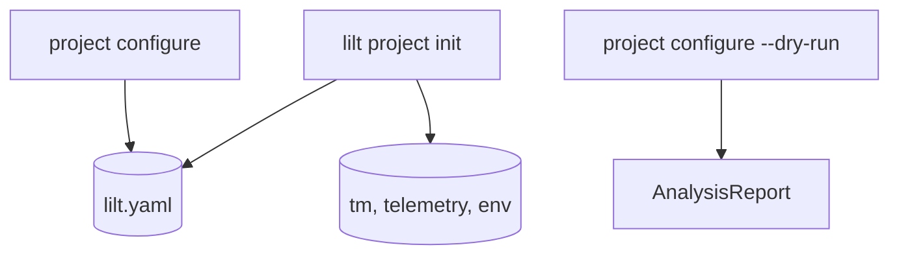

# Platform

## Purpose

Defines workspace layout, hybrid storage formats, configuration schema, and
operational conventions for running LILT in a Git-friendly local environment.

## Invariants

- Configuration: strict YAML 1.2 in `.lilt/lilt.yaml`, validated on load via `LiltConfig` (Pydantic).
- Service-layer preconditions (`WorkspacePreconditions`) gate pipeline/TM operations; CLI does not duplicate guards.
- Translation Memory: JSONL under `.lilt/tm/`, one file per namespace.
- Secrets: API keys in `.lilt/.env` or workspace `.env`, not committed.
- LILT never force-pushes or auto-commits to Git (user-managed workflow).

## Configuration

### Defaults (emitted by `lilt project init`)

| Key | Default | Description |
|-----|---------|-------------|
| `project.source_lang` | `English` | Source language label for prompts |
| `project.target_lang` | `Spanish` | Target language label |
| `project.domain_context` | `""` | Injected into LLM prompts |
| `project.injections` | `[]` | Preamble packages injected at build |
| `review.queue_statuses` | `[refined, reviewed]` | Review queue statuses |
| `llm.provider` | `openai` | Provider adapter name |
| `llm.model` | `local-model` | Base model identifier |
| `llm.base_url` | `http://localhost:1234/v1` | OpenAI-compatible endpoint |
| `llm.temperature` | `0.3` | Draft phase temperature |
| `llm.reflection_temperature` | `0.0` | Critique/refine temperature |
| `llm.max_tokens` | `4096` | Max generation tokens (must be less than `model_context_limit`) |
| `llm.model_context_limit` | `8192` | Context window for budgeting |
| `llm.output_token_mode` | `shared_budget` | Shared vs split output reservation |
| `project.domain_context_max_tokens` | `512` | Domain context token cap |
| `llm.context_window` | `3` | Neighbor segments for RAG |
| `llm.translation_mode` | `workflow` | `workflow` or `sequential` |
| `llm.timeout` | `600.0` | HTTP timeout seconds |
| `llm.draft_empty_retries` | `1` | Draft attempts on empty LLM output before segment `error` |
| `llm.token_price_per_million` | `5.0` | Rough cost estimate in `tm status` |
| `llm.retry.max_attempts` | `3` | Tenacity retry cap |
| `llm.retry.min_wait_seconds` | `2` | Backoff minimum |
| `llm.retry.max_wait_seconds` | `60` | Backoff maximum |
| `parser.custom_macros` | `[]` | Custom `MacrosDef` entries |
| `parser.identity.similarity_threshold` | `0.85` | Sync carry-forward threshold |
| `parser.block_transparent_macros` | (list) | Sectioning/list macros |

### Advanced (supported, not in default `init`)

| Key | Description |
|-----|-------------|
| `llm.reflection_enabled` | Default `true` in factory; disable for single-pass |
| `llm.stages` | Per-stage provider/model → `RouterLLMProvider` |
| `llm.prompt_dir` | Override Jinja2 prompt template directory |
| `llm.draft_model` / `critique_model` / `refine_model` | Per-stage models on single provider |
| `llm.context_window` | Dict `{draft, critique, refine}` for per-stage windows |
| `parser.protected_terms` | Lexical terminology mask list |
| `parser.opaque_environments` | Extra opaque environment names |
| `parser.environment_aliases` | Populated by `project configure --include-aliases` |
| `parser.inline_transparent_macros` | Additional transparent macros |
| `parser.max_segment_chars` | (optional) Maximum masked segment length; exceed → `ConfigurationError` |

### Typed configuration (`LiltConfig`)

YAML is loaded in two stages:

1. **`load_yaml_config`** — strict YAML 1.2 syntax, `${VAR}` interpolation (unset env without `:-default` → `ConfigurationError`).
2. **`load_lilt_config`** — Pydantic validation into `LiltConfig` with nested `ProjectConfig`, `LLMConfig`, `ParserConfig`, `ReviewConfig`.

Services consume `LiltConfig`, not raw `dict`.

### Workspace preconditions

`WorkspacePreconditions` (via `WorkspaceContext.preconditions`) centralizes guards:

| Method | Use |
|--------|-----|
| `require_initialized()` | Workspace has `lilt.yaml` |
| `require_namespace_file_exists(ns)` | TM JSONL file exists (does not load contents) |
| `require_namespace(ns)` | TM JSONL exists and has at least one segment |

`translate`, `build`, `review`, and `get_stats` call `require_namespace` in the service layer.

Path sandboxing is **not** a precondition guard: `WorkspaceContext.resolve_under_workspace()` raises `WorkspacePathError` when a path escapes the workspace.

## Data flow



## Behavior

### Workspace layout

```text
project/
  .lilt/
    lilt.yaml          # Configuration
    .env               # Secrets (optional)
    tm/                # JSONL translation memory
      <namespace>.jsonl
    telemetry.db       # SQLite inference log
    .gitignore         # Ignores .env if git initialized
  source.tex           # Upstream LaTeX (user-managed)
```

### Hybrid storage

- **YAML** for small, human-edited config (readability, rare concurrent edits).
- **JSONL** for TM (O(1) append, line-level Git merges, streaming load).
- All structures validated via Pydantic on load.

### Git workflow

LILT encourages user-managed Git: commit JSONL TM alongside source. Stable segment
IDs (see [02-persistence](02-persistence.md)) keep diffs reviewable.

**NOT IMPLEMENTED:** auto-branch on sync, commit hooks, `source/` upstream tracking.

### Environment and secrets

- `load_dotenv` checks workspace `.env` then `.lilt/.env`.
- `WorkspaceContext.resolve_under_workspace()` sandboxes file paths within the workspace (`WorkspacePathError` on escape).

## Decisions

| Decision | Rationale | Rejected alternative |
|----------|-----------|---------------------|
| Hybrid YAML + JSONL | Readability vs performance at scale | Monolithic YAML TM |
| Pydantic validation | Prevent ambiguous YAML typing | Untyped config dict |
| User-managed Git | Leverage existing VCS tooling | Built-in conflict UI |
| `.lilt/` workspace dir | Clear separation from LaTeX tree | Config in repo root only |

## Implementation map

| Module / class | Responsibility |
|----------------|----------------|
| `models/config.py` | `LiltConfig` and nested config models |
| `utils/config_loader.py` | `load_lilt_config()` |
| `services/preconditions.py` | `WorkspacePreconditions` |
| `services/project_service.py` | `DEFAULT_CONFIG`, init, configure |
| `utils/yaml_loader.py` | Strict YAML load and env interpolation |
| `services/workspace_context.py` | Compose services from config path |
| `services/pipeline_service.py` | Path sandbox verification |

## Failure modes

| Condition | Effect | Recovery |
|-----------|--------|----------|
| Missing `.lilt/lilt.yaml` | `ProjectNotInitializedError` | `lilt project init` |
| Empty `lilt.yaml` (null / `{}`) | `ConfigurationError` — silent full defaults are not applied | Add at least `project` (and preferably `llm`) |
| Invalid YAML / schema | `ConfigurationError` with field detail | Fix `lilt.yaml` |
| Unset `${VAR}` without default | `ConfigurationError` on load | Set env or add `:-default` |
| Path outside workspace | Rejected | Use paths under project root |

## Known gaps

- Git auto-branch and `source/` upstream model not implemented (see [appendix-deferred](appendix-deferred.md)).
- Multi-language `.lilt/<lang>/` layout not implemented.

Advanced configuration keys are emitted as commented examples in generated `lilt.yaml` (see `INIT_ADVANCED_COMMENTS` in `project_service.py`).

## Open / deferred

See [appendix-deferred](appendix-deferred.md) for Git automation and multi-language layout.
