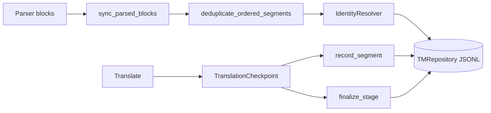
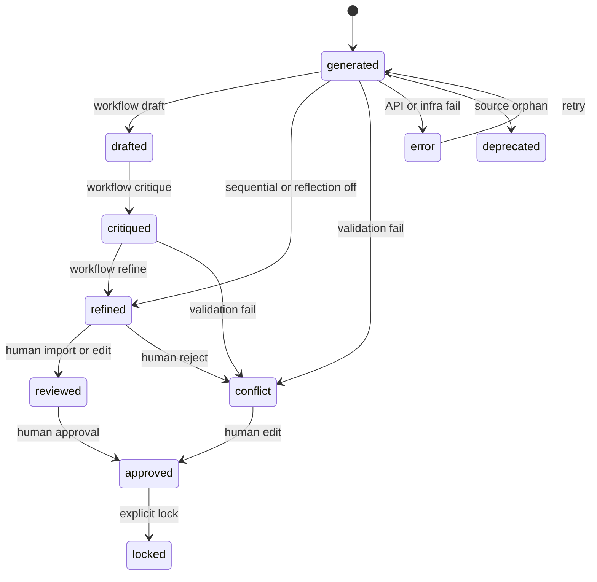

# Persistence

## Purpose

The Translation Memory (TM) is the single source of truth for localization. This
domain defines how segments are modeled, identified, versioned on disk, and
transitioned through their lifecycle.

## Invariants

- Terminal machine-translation state is **`refined`**; **`reviewed`** is for human-imported content.
- **`locked`** is assigned only via `lilt tm set-status`, never by the LLM pipeline.
- **`deprecated`** means orphaned from the current source parse; retained until `lilt tm admin prune`.
- **`error`** is infrastructure/API failure; **`conflict`** is linguistic or validation failure.
- Append-only writes during translation; compaction at phase end.
- Namespace = relative path of source `.tex` encoded flat (e.g. `main.tex` → `main.jsonl`; `chapters/intro.tex` → `chapters__intro.jsonl`). Root-level files keep the basename for backward compatibility.
- Sync fails loud when two distinct `.tex` paths under the workspace derive the same namespace (e.g. `chapters/intro.tex` vs `chapters__intro.tex`); silent TM merge is not allowed.

## Configuration

| Key | Default | Description |
|-----|---------|-------------|
| `parser.identity.similarity_threshold` | `0.85` | Minimum masked-text similarity for identity carry-forward during sync |

See [01-platform](01-platform.md) for workspace layout and full config reference.

## Data flow

## Behavior

### Pydantic multi-model schema

| Model | Role |
|-------|------|
| `SegmentBase` | Shared fields: `source_hash`, `source_text`, `status` |
| `StoredSegment` | Full record: `translation`, `history`, `draft`/`critique`/`refined` artifacts, `placeholders`, `reflection_meta`, `error_meta` |
| `StageArtifact` | Intermediate stage output (`content`, LLM `model`, `timestamp`) for draft/critique/refined slots |

### Segment lifecycle (10 statuses)

**Machine path:** `generated` → `drafted` → `critiqued` → `refined`

**Human gates:** `reviewed` → `approved` → `locked`

**Exceptions:** `conflict`, `error`, `deprecated`

### Segment identity

**Phase 1 (content hash):** `id = SHA-256(whitespace-normalized raw text)[:12]`. Deterministic and position-independent.

**Phase 2 (sequence alignment):** During `sync_parsed_blocks`:

1. Load existing segments in JSONL file order.
2. Align prior and new block hashes with `difflib.SequenceMatcher`.
3. For replace/insert pairs where IDs differ but similarity exceeds threshold, carry translation forward via `IdentityResolver`.
4. Human-protected statuses (`locked`, `approved`, `reviewed`) become `conflict` with translation preserved; LLM-only statuses reset to `generated`.
5. After carry-forward, if the copied translation fails placeholder/syntax validation against the new source, clear the translation (human-protected stays `conflict`; buildable statuses drop to `conflict`).

After carry-forward, `id` and `source_hash` may diverge.

### Error metadata

`ErrorMeta` captures `error_type`, `message`, `timestamp` on `error` status segments. Separate from `conflict` for observability and programmatic aggregation.

### Append-only JSONL

During translation, `TranslationCheckpoint.record_segment()` delegates to
`TMRepository.append_segment()` (one JSON line per update, O(1) I/O). Duplicate
segment IDs in the file are resolved last-wins on load. At phase end,
`TranslationCheckpoint.finalize_stage()` compacts via `save_namespace()` to a
single row per segment.

Before sync alignment, `deduplicate_ordered_segments()` collapses duplicate
JSONL lines so `IdentityResolver` sees one logical row per segment ID.

`FileLock` (10s timeout) guards concurrent TM writes. On lock timeout,
`TMRepository` retries up to three times with exponential backoff; persistent
failure raises `TMConcurrencyError`.

### Durability guarantees

| Operation | Guarantee |
|-----------|-----------|
| `save_namespace` | Atomic write via `.tmp` + `os.replace`, `fsync` |
| `append_segment` | Newline-terminated line + `fsync` |
| `sync_parsed_blocks` | Same atomic save pattern as `save_namespace` |
| JSONL load | Truncated final line (no newline) → `TMCorruptionError` with path and line number |

This ensures durability and interrupt handling during crashes.

### Segment status transitions

`SegmentTransitionPolicy` defines allowed CLI/import transitions. Human paths:
`refined → reviewed → approved`; `DEPRECATED` only via sync; reset to `generated`
requires `--force`. Enforced in `TMService.update_segment_status` and TM import.
Import rows that change translation text must pass `SegmentTranslationValidator`
(placeholder multiset / syntax); failing rows are skipped.

## Decisions

| Decision | Rationale | Rejected alternative |
|----------|-----------|---------------------|
| Pydantic multi-model | Runtime validation, clear create vs load APIs | Raw dicts, dataclasses |
| JSONL per namespace | Git-friendly, O(1) append, line-level merges | Monolithic YAML TM |
| Content-hash IDs | Non-intrusive, survives paragraph moves | Line numbers, `\label` injection |
| Sequence alignment | Mitigates typo-induced orphaning | Full AST-node diffing (deferred) |
| Separate `error` status | Distinguish infra from linguistic failures | Overload `conflict` |
| Append-only + compaction | Crash-safe partial progress without SQLite | SQLite TM, event sourcing |
| `StoredSegment` naming | Domain-oriented type name; JSONL schema unchanged | Persistence-layer suffix (`*InDB`) |

## Implementation map

| Module / class | Responsibility |
|----------------|----------------|
| `models/segment.py` | `SegmentStatus`, `StoredSegment`, `StageArtifact`, `ErrorMeta` |
| `models/segment_policy.py` | Eligibility, immutability rules |
| `models/status_resolver.py` | CLI aliases (`untranslated` → `generated`) |
| `models/sync_result.py` | `SyncResult` metrics from sync operations |
| `models/segment_transition.py` | `SegmentTransitionPolicy` for status changes |
| `models/translation_stage.py` | `TranslationStage` enum |
| `tm/repository.py` | JSONL load/save, `append_segment`, `deduplicate_ordered_segments`, `FileLock` |
| `tm/checkpoint.py` | `TranslationCheckpoint` (`record_segment`, `finalize_stage`, `record_and_finalize_if_last`) |
| `tm/identity_resolver.py` | Carry-forward on sequence alignment |
| `tm/source_change.py` | `SourceChangePolicy` on upstream text changes |
| `core/sync.py` | `sync_parsed_blocks` orchestration |
| `core/review_policy.py` | `review.queue_statuses` for review queue |

## Failure modes

| Condition | Status | Recovery |
|-----------|--------|----------|
| Validation failure after retries | `conflict` | `pipeline edit` or re-translate with `--force` |
| LLM timeout / API error | `error` | Fix config; re-translate eligible segments |
| Source change on human segment | `conflict` | Manual merge via editor |
| Minor upstream edit (aligned) | Carry-forward or `generated` | Automatic via identity resolver |
| Process crash mid-run | Partial append lines | Reload; resume translate |
| Corrupt JSONL line | `TMCorruptionError` on strict load | `lilt tm admin repair` (file-exists check only, then skips bad lines and backs up) |
| Concurrent namespace mutation | `NamespaceBusyError` | Wait for the other operation; do not run sync and translate in parallel on the same namespace |
| Lock contention | `TMConcurrencyError` after retries | Re-run command |
| Illegal status transition | `ValidationError` / domain error | Use allowed transition or `--force` |

## Concurrency invariant

Only **one mutating operation per namespace** may run at a time (sync, translate,
import, reset, edit, `set-status`). The repository enforces this via a
non-blocking session lock (`*.session.lock`). Per-operation file locks remain as
a secondary safeguard. Full transactional read-modify-write across arbitrary
call paths is deferred (see [appendix-deferred](appendix-deferred.md)).

## Known gaps

- Full `audit_log` (who edited, model provenance per edit) deferred to Phase 2.
- AST-node diffing for structural moves without text overlap not implemented.
- Namespace encoding still uses `__` for separators; collisions are detected at sync rather than prevented by a collision-free encoding (migration of existing TM IDs deferred).

## Open / deferred

- Multi-language `.lilt/<lang>/` layout (PRD Phase 2).
- Declarative validation via `@model_validator` on segment models.
- Transactional read-modify-write spanning arbitrary load/mutate/save cycles (session lock is the 1.0 mitigation).
