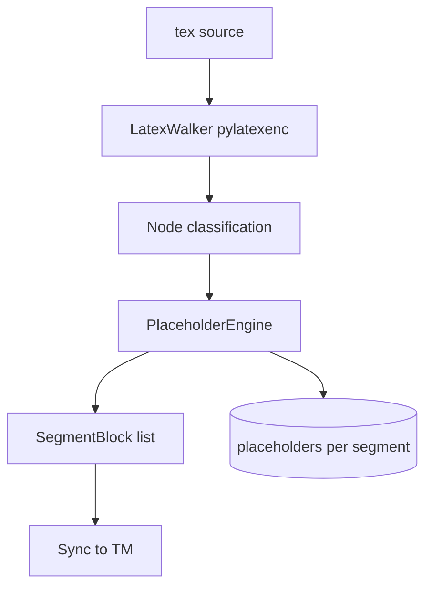

# Parser and Masking

## Purpose

Transform LaTeX source into ordered translatable segments while masking structural
content the LLM must not alter. Defines node classification, placeholder taxonomy,
lexical term protection, and linguistic bypass.

## Invariants

- Masking is deterministic and reversible via persisted placeholder maps.
- Placeholder set in translation must exactly match source (validated post-LLM).
- Non-translatable segments (`is_translatable() == false`) skip the LLM pipeline.
- Regex is allowed only for dependency graph resolution, not for structural parsing.
- Gap-preserving roundtrip: concatenating parsed `SegmentBlock.raw_text` must reproduce source byte-for-byte (`verify_lossless_roundtrip` after `parse_text` / `parse_file`).

## Configuration

| Key | Default | Description |
|-----|---------|-------------|
| `parser.custom_macros` | `[]` | `MacrosDef` specs for project-specific macros |
| `parser.block_transparent_macros` | see `DEFAULT_CONFIG` | Macros treated as transparent wrappers |
| `parser.protected_terms` | (not in init) | Word-boundary lexical mask list |
| `parser.opaque_environments` | (not in init) | Additional opaque environments |
| `parser.environment_aliases` | auto via `configure` | Semantic alias resolution |
| `parser.identity.similarity_threshold` | `0.85` | Sync identity carry-forward |
| `parser.max_segment_chars` | (not in init) | Reject oversized masked segments at parse time |

Advanced keys documented in [01-platform](01-platform.md).

### Segmentation contract

- Empty `.tex` file → zero blocks (explicit, not accidental).
- `parser.max_segment_chars`, when set, raises `ConfigurationError` if a masked segment exceeds the limit.

## Data flow

## Behavior

### AST parsing

`LatexParser` uses `pylatexenc` with configurable `MacrosDef` from `parser.custom_macros`.
Token-iterator fallback handles alias stacks. `ProjectAnalyzer` reports gaps and
dependencies; `project configure --dry-run` surfaces structural issues.

### Placeholder taxonomy (canonical)

| Prefix | Covers | Example |
|--------|--------|---------|
| `<ref id="N"/>` | `\ref`, `\cref`, `\autoref`, `\pageref`, `\eqref` | Reference macros |
| `<cite id="N"/>` | `\cite`, `\citep`, `\citet`, `\citeyear` | Citation macros |
| `<math id="N"/>` | Inline and display math | `$x=1$`, `equation` env |
| `<env id="N"/>` | Opaque environments | `lstlisting`, `tikzpicture` |
| `<macro id="N"/>` | Other opaque macros | `\label`, `\url`, `\input` |
| `<arg id="N"/>` | Opaque macro arguments | First argument of two-arg macros |
| `<group_start id="N"/>` / `<group_end id="N"/>` | Delimiter tokens for grouped macros | `{` / `}` wrappers preserved as opaque |
| `<comment id="N"/>` | LaTeX comments | `% ...` lines |
| `<term id="N"/>` | Lexical protected terms | Word-boundary matches |
| `<block id="N"/>` | Compressed adjacent placeholders | `compress_blocks` output |

`compress_blocks` merges consecutive placeholder tokens to reduce token count.

### Node categories

1. **Opaque** — fully masked; LLM never sees content.
2. **Transparent** — structural wrapper; recurse into children.
3. **Deep traversal** — `figure`, `table`, `itemize`, `document`, etc.
4. **Argument-level** — mask macro arguments while exposing inner text (`MacroMaskPolicy` registry per macro, e.g. `\textcolor`, `\href`).
5. **Lexical** — in-text `protected_terms` via `\b` word boundaries.
6. **Aliases** — resolved via `environment_aliases`, `EnvironmentStack`, and dependency graph.

`EnvironmentStack` tracks `\begin`/`\end` pairing; mismatched or unclosed aliases fall back to opaque masking over the open span (no raw LaTeX leakage).

### Placeholder contract

`placeholder_contract.py` is the single source of truth for placeholder regex (`PLACEHOLDER_RE`, case-insensitive), extraction, mapping validation, and zero-length range rejection. `PlaceholderEngine`, `PlaceholderValidator`, and `BuildValidator` import this module.

### Linguistic bypass

At parse time, `SegmentBlock.is_translatable()` (via `parser.linguistic.has_linguistic_content`)
filters segments with no prose (e.g. pure placeholders, isolated numerals). At provider
time, the same alphabetic-content check short-circuits full D→C→R. Telemetry records
`is_heuristic_simple` / bypass flag.

## Decisions

| Decision | Rationale | Rejected alternative |
|----------|-----------|---------------------|
| pylatexenc AST | Structural understanding vs regex | Regex-only parser |
| Semantic placeholder prefixes | Validator exact-set matching | Generic `<block>` only |
| YAML-driven `custom_macros` | Project extensibility without code | Hardcoded macro list only |
| Lexical `\b` masking | Zero-token jargon protection | Require `\term{}` macros |
| Two-layer bypass | Save tokens on non-prose segments | Send everything to LLM |

## Implementation map

| Module / class | Responsibility |
|----------------|----------------|
| `parser/ast_parser.py` | `LatexParser`, segment extraction |
| `parser/mask_policy.py` | `MacroMaskPolicy`, per-macro argument roles |
| `parser/environment_stack.py` | Environment pairing and alias fallback |
| `parser/placeholder_contract.py` | Canonical placeholder regex and validation |
| `parser/placeholder_engine.py` | Mask/unmask, `compress_blocks` |
| `parser/dependency_resolver.py` | Environment alias graph |
| `parser/analyzer.py` | `ProjectAnalyzer`, gap reports |
| `parser/roundtrip.py` | `verify_lossless_roundtrip` — byte-for-byte reconstruction check after parse |
| `parser/linguistic.py` | Linguistic content heuristics (`has_linguistic_content`) |
| `utils/path_utils.py` | Workspace path containment helpers |
| `llm/base_provider.py` | Provider-side bypass check |

## Failure modes

| Condition | Effect | Recovery |
|-----------|--------|----------|
| Unknown macro (default opaque) | Masked as `<macro>` | Add to `transparent_macros` or `custom_macros` |
| Gap in parse | Reported in `configure --dry-run` | Manual source fix |
| Placeholder drift at build | `BuildValidator` error | Re-sync namespace |
| Protected term substring false positive | Over-masking | Refine `protected_terms` list |

## Known gaps

- `parser.protected_terms` and `parser.opaque_environments` are documented in generated
  `lilt.yaml` comments but not enabled by default.

## Open / deferred

- Plugin hooks for custom classification ([appendix-deferred](appendix-deferred.md)).
