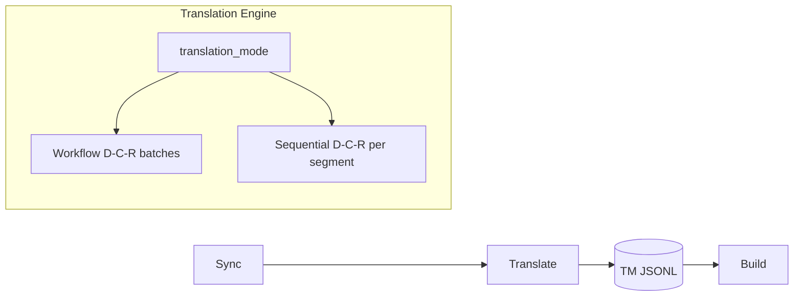

# Translation Engine

## Purpose

Orchestrates `lilt pipeline translate`: how segments move through reflection
stages, how context is assembled, how validation gates progression, and how
workflow vs sequential execution modes differ.

## Invariants

- Terminal MT state is **`refined`**.
- **`sequential`** is first-class (A/B benchmarking, not deprecated).
- Infrastructure failures → **`error`**; validation failures → **`conflict`**.
- `SegmentTranslationValidator` runs before TM commit (workflow refine; sequential final; human edits).
- LLM output is validated at the provider boundary via `LLMOutputGate` (empty output when source has linguistic content → `EmptyLLMOutputError`). Empty output is not retried by tenacity; the workflow uses `llm.draft_empty_retries` (default `1`, fast-fail).
- Segment processing uses `SegmentUnitOfWork` for crash/interrupt-safe snapshot rollback.
- `conflict` segments are not re-translated without `--force` or explicit `--status`.

## Configuration

| Key | Default | Description |
|-----|---------|-------------|
| `llm.translation_mode` | `workflow` | `workflow` or `sequential` |
| `llm.reflection_enabled` | `true` (factory) | Single-pass when `false` |
| `llm.context_window` | `3` | Segment pairs for context (int or per-stage dict) |
| `llm.reflection_temperature` | `0.0` | Critique and refine temperature |
| `review.queue_statuses` | `[refined, reviewed]` | Statuses eligible for `pipeline review` |

Advanced: per-stage `context_window: {draft: N, critique: N, refine: N}` — see [05-llm-layer](05-llm-layer.md).

## Data flow



## Behavior

### Execution modes

| Mode | Class | Behavior |
|------|-------|----------|
| `workflow` (default) | `WorkflowReflectionStrategy` | Breadth-first: draft all → critique all → refine all |
| `sequential` | `SequentialReflectionStrategy` | Depth-first: full D→C→R per segment before the next |

Resolved by `TranslationMode.from_llm_config()`.

### Reflection pipeline (`reflection_enabled: true`)

```text
generated → drafted → critiqued → refined
```

- **Draft:** contextual RAG with bidirectional window in workflow; backward-priority in sequential.
- **Critique:** MQM JSON; short-circuits refine when `requires_refine: false`. No placeholder/syntax validation on critique output.
- **Refine:** correction pass; up to **3 validation retries** with error feedback appended to critique text (both workflow and sequential).
- Re-draft clears prior `critique` and `refined` artifacts.

### Context resolution

Priority for neighbor text: **`translation` > `refined` > `draft`**.

| Mode / stage | Context window |
|--------------|----------------|
| Workflow draft | Backward, translation-first |
| Workflow critique/refine | Bidirectional (past + future drafts) |
| Sequential | `resolve_for_refine()`: backward-priority; **forward applies only when future segments already have translations** (typical on `--force` re-runs) |

Token budgeting uses `tiktoken` against `model_context_limit` minus `max_tokens` (see [05-llm-layer](05-llm-layer.md)).

### Validation (MVP)

| Validator | When | On failure |
|-----------|------|------------|
| `SegmentTranslationValidator` | After draft/refine (workflow); after full pass (sequential); human edits via `submit_human_translation` / `update_segment_translation` | `conflict` or CLI error (no persist) |
| `BuildValidator` | At build time | `ValidationError` before stitch |

#### Exception boundaries

| Type | Layer | When raised | User impact |
|------|-------|-------------|-------------|
| `ValidationError` | `validation/validators.py` | Structural check fails inside engine or build | Segment → `conflict`; build aborts before write |
| `TranslationValidationError` | `lilt/exceptions.py` | Human edit (`pipeline edit` / `review`) fails validation | CLI message; TM unchanged |
| `PreconditionError` | `lilt/exceptions.py` | Invalid segment state before LLM call | Propagates to CLI (not `error` / `conflict`) |
| `EmptyLLMOutputError` | `llm/output_gate.py` | Provider returns empty text for non-trivial source | Fast-fail by default (`draft_empty_retries=1`); segment → `error` with detail in CLI progress (workflow and sequential); sequential continues the batch |

`ValidationError` is an internal signal caught by strategies and build code.
`TranslationValidationError` is the user-facing domain error for interactive edits.
`PreconditionError` and `MultipleSegmentsFoundError` propagate without marking infrastructure errors.
Do not catch or raise them interchangeably.

### Segment unit of work

`process_segment` (in `segment_uow.py`) wraps each segment mutation:

1. Deep-copy snapshot before translation.
2. On `Exception` or `KeyboardInterrupt`, restore snapshot in memory and persist coherent state.
3. `finally`: `record_and_finalize` via checkpoint.

CLI reports precise interrupt messaging (completed segments retained; in-flight segment reverted).

MQM tiers: L1 structural (validators), L2 terminology (lexical mask; validator deferred), L3 fluency (RAG + reflection).

### Policies

- **`SegmentPolicy`:** immutability (`locked`, `deprecated`); per-mode eligibility; `--id` prefix matching.
- **`ReviewPolicy`:** drives `pipeline review` queue from `review.queue_statuses`.
- **`StatusResolver`:** CLI aliases (`untranslated`/`pending` → `generated`, `machine_done` → `refined`).

### Sequential-specific behavior

- `--stage` ignored (warning logged); always full D→C→R per segment.
- Does not persist `draft`/`critique`/`refined` artifacts in TM (only final `translation` + `reflection_meta`).
- Uses the same refine validation retry loop (`REFINE_MAX_VALIDATION_RETRIES`, 3×) as workflow; failure → `conflict`.

### Prompt management

`PromptManager` loads Jinja2 templates from `llm.prompt_dir` (default: packaged `src/lilt/prompts/`). `project.domain_context` injected at runtime. No prompts in `lilt.yaml`.

## Decisions

| Decision | Rationale | Rejected alternative |
|----------|-----------|---------------------|
| Workflow default | Better GPU utilization for local models | Sequential-only |
| Retain sequential | A/B metrics, backward-refined context purity | Deprecate sequential |
| Critique JSON short-circuit | Save tokens when draft is acceptable | Always run refine |
| Refine validation retry (3×) | Auto-recover placeholder/brace errors | Immediate conflict |
| Separate error vs conflict | Observability and recovery paths | Single failure status |
| Internal `status_filter` parameter | Clarifies `--status` is a filter, not a target state | Keep misleading `target_status` name |
| Jinja prompt files | Version-controlled, overridable templates | Prompts in YAML |

## Implementation map

| Module / class | Responsibility |
|----------------|----------------|
| `core/translation/pipeline.py` | `TranslatorPipeline` orchestration |
| `core/translation/workflow_strategy.py` | `WorkflowReflectionStrategy` (breadth-first scheduling + `_execute_*` stage methods) |
| `core/translation/sequential_strategy.py` | `SequentialReflectionStrategy` |
| `llm/reflection_pass.py` | Canonical D→C→R stage semantics (`run_draft`, `run_critique`, `run_refine`, `run_reflection_pass`; `REFINE_MAX_VALIDATION_RETRIES`) |
| `core/translation/context_resolver.py` | Per-stage context windows |
| `core/translation/progress_events.py` | CLI progress event builders (`progress_pass`, `progress_validation_fail`, `progress_error`) |
| `models/segment.py` | `StoredSegment` lifecycle transitions (`apply_successful_translation`, `mark_validation_conflict`, `mark_infrastructure_error`) |
| `models/segment_policy.py` | Eligibility, immutability |
| `core/review_policy.py` | Review queue statuses |
| `models/status_resolver.py` | Status CLI aliases |
| `models/translation_mode.py` | `translation_mode` enum resolution |
| `core/translation/segment_uow.py` | `process_segment` interrupt-safe UoW |
| `llm/output_gate.py` | `validate_llm_output`, `EmptyLLMOutputError` |
| `tm/checkpoint.py` | `TranslationCheckpoint` append + stage-end compaction |
| `validation/validators.py` | `SegmentTranslationValidator`, `PlaceholderValidator`, `SyntaxValidator`, `BuildValidator` |
| `services/pipeline_service.py` | `submit_human_translation` for human edits |
| `llm/prompt_manager.py` | Jinja2 template loading |
| `llm/critique_parser.py` | Parse critique JSON from LLM output |

### Domain vocabulary note

The engine implements a **reflection pipeline by stages** (draft, critique, refine) with
optional per-stage LLM routing. It does not model first-class *agents* or inter-agent
messaging; stage roles are expressed through prompts, provider methods, and persisted
artifacts.

## Failure modes

| Condition | Status | Recovery |
|-----------|--------|----------|
| Placeholder mismatch | `conflict` | Edit or `--force` re-translate |
| Syntax delta mismatch | `conflict` | Same |
| Refine retries exhausted (workflow) | `conflict` | Human edit |
| LLM timeout / 5xx | `error` | Adjust `timeout`/`retry`; re-run |
| `--stage draft` on `error` segment | Re-eligible for draft | Workflow partial re-run |

## Known gaps

- `TerminologyValidator` and `StructureValidator` not implemented (Phase 2).
- Critique stage output is not validated before refine.

## Open / deferred

- Phase 2 validators integrated with glossary.
- Benchmark-driven decision on strict backward-only sequential context.
