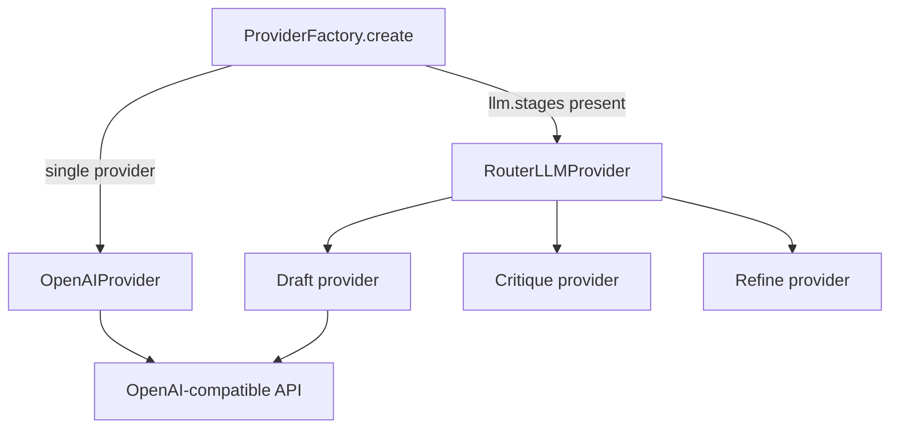

# LLM Layer

## Purpose

Abstracts LLM inference behind a stable protocol, supports multi-provider routing
per reflection stage, handles retries and timeouts, and emits structured responses
for telemetry.

## Invariants

- Custom `LLMProvider` protocol; no LangChain dependency.
- Secrets from environment; `api_key` in yaml for local-only setups.
- Retries on transient failures (5xx, rate limit); not on 4xx auth errors.
- `model_context_limit` and `max_tokens` are separate concerns.
- Token budgeting is provider-agnostic (OpenAI-compatible endpoints only; no vendor lock).
- Never call the API when fudged prompt + chat overhead + reserved output exceeds
  `model_context_limit`.

## Configuration

| Key | Default | Description |
|-----|---------|-------------|
| `llm.provider` | `openai` | Factory adapter name |
| `llm.model` | `local-model` | Base model |
| `llm.base_url` | `http://localhost:1234/v1` | API endpoint |
| `llm.draft_model` / `critique_model` / `refine_model` | `""` | Fallback to `model` |
| `llm.stages` | (optional) | Per-stage `{provider, model, base_url, model_context_limit, ...}` |
| `llm.reflection_enabled` | `true` | Enable D→C→R in provider |
| `llm.timeout` | `600.0` | Request timeout |
| `llm.draft_empty_retries` | `1` | Draft attempts on empty LLM output before segment `error` |
| `llm.retry.max_attempts` | `3` | Tenacity attempts |
| `llm.model_context_limit` | `8192` | Physical context window for budgeting |
| `llm.max_tokens` | `4096` | Completion cap (`max_tokens` request field) |
| `llm.output_token_mode` | `shared_budget` | `shared_budget` or `split_budget` |
| `llm.reasoning_reserve` | `0` | Extra reservation when `split_budget` |
| `llm.tokenizer_fudge` | `1.1` | Multiplier on measured prompt tokens |
| `llm.chat_template_overhead` | `48` | Chat-template / role overhead tokens |
| `project.domain_context_max_tokens` | `512` | Cap for injected domain context |

## Data flow



## Behavior

### Provider protocol

`LLMProvider` defines `generate_draft`, `generate_critique`, `generate_refine`,
`stage_model_name`, `get_prompt_version`, and `translate_segment_iter`. Returns
`LLMResponse` with `text`, `duration_ms`, token counts, optional `bypass` flag.

`stage_model_name(stage)` resolves the model identifier for telemetry and artifact
metadata uniformly across single-model and router providers (no `isinstance` checks
in the translation engine).

`translate_segment_iter` is a **thin adapter** over
`llm/reflection_pass.py` for the sequential execution path; it delegates to
`run_reflection_pass` and yields `status` / `result` events without persisting
workflow artifacts.

### Two routing patterns

1. **`llm.stages`** — `ProviderFactory` builds `RouterLLMProvider` delegating draft,
   critique, refine to distinct provider instances (hybrid local + cloud).
2. **Per-stage model fields** — single `OpenAIProvider` with `draft_model`,
   `critique_model`, `refine_model` overrides.

### Reflective workflow (canonical semantics)

Stage orchestration lives in `llm/reflection_pass.py`. Providers expose
the three `generate_*` primitives; strategies and `translate_segment_iter` call
`reflection_pass` rather than duplicating short-circuit and retry logic.

When `reflection_enabled`:

1. Draft with context and `temperature`.
2. Critique with `reflection_temperature` (default 0.0).
3. Refine unless critique JSON sets `requires_refine: false`.

`CritiqueParser` extracts JSON from fenced blocks or raw output. Both workflow and
sequential modes use `REFINE_MAX_VALIDATION_RETRIES` (default 3) for refine
validation retries via the shared `run_refine` implementation.

### Retry policy

`tenacity` exponential backoff between `min_wait_seconds` and `max_wait_seconds`.
Configurable via `llm.retry.max_attempts`. Exhausted retries surface as segment `error`.

### Context budgeting

`plan_token_budget` is the numeric SSOT (no I/O, no `base_url`). Per call:

```text
reserved_output = max_tokens                         # shared_budget
                | max_tokens + reasoning_reserve     # split_budget

neighbor_budget = context_limit
  - reserved_output
  - ceil(fixed_prompt_tokens * tokenizer_fudge)
  - chat_template_overhead
  - safety_margin   # max(64, floor(0.02 * context_limit))
```

`fixed_prompt_tokens` is measured via `PromptManager.measure` (system with empty
neighbor block + stage user template). `pack_neighbor_context` fills
`neighbor_budget` with backward-first alternation. Call gate in `_call_llm`:

```text
ceil(sum(count(messages)) * fudge) + overhead + reserved_output
  <= model_context_limit
```

Batch preflight (`budget_preflight`) runs before the segment loop: for each
stage provider (router-aware), plan against the largest eligible source; abort
with `BudgetPreflightError` if infeasible.

**OpenAI-compatible / per-stage profiles:** `llm.stages.*` merges the same
budget fields as top-level `llm` (`model_context_limit`, `max_tokens`,
`output_token_mode`, …). Local + remote mix ⇒ distinct plans per stage.

## Decisions

| Decision | Rationale | Rejected alternative |
|----------|-----------|---------------------|
| Custom protocol | Minimal deps, full control | LangChain chains |
| Router for `llm.stages` | Hybrid GPU/cloud without pipeline changes | Multiple CLI invocations |
| Tenacity retries | Battle-tested backoff | Manual retry loops |
| Agnostic planner + packer | Accurate headroom; no vendor strings | Heuristic 600-token system estimate |
| Separate context vs output limits | Reserve completion against n_ctx | Single token field |
| OpenAI-compatible first | Any OpenAI-compatible serving stack | Provider-specific SDKs only |

## Implementation map

| Module / class | Responsibility |
|----------------|----------------|
| `llm/provider.py` | `LLMProvider` protocol (`plan_budget`, `stage_model_name`), `LLMResponse` |
| `llm/openai_provider.py` | OpenAI-compatible client, call gate, starvation check |
| `llm/token_budget.py` | `plan_token_budget` / `call_footprint` / `BudgetPlan` |
| `llm/context_packer.py` | `pack_neighbor_context` under `neighbor_budget` |
| `llm/budget_preflight.py` | Batch infeasibility abort via provider `plan_budget` |
| `llm/router_provider.py` | Stage delegation, per-stage model resolution, `plan_budget` |
| `llm/factory.py` | `ProviderFactory.create` (openai / OpenAI-compatible only) |
| `llm/base_provider.py` | `stage_model_name` default, `plan_budget` stub, `translate_segment_iter` adapter |
| `llm/critique_parser.py` | Critique JSON parsing |
| `llm/reflection_pass.py` | Canonical D→C→R stage semantics |
| `telemetry/service.py` | `record_inference_from_llm` |

## Failure modes

| Condition | Effect | Recovery |
|-----------|--------|----------|
| ReadTimeout | `error` status | Increase `timeout` |
| RateLimitError | Retry then `error` | Backoff / different provider |
| 401 / auth | No retry, `error` | Fix API key |
| Neighbors over budget | Truncated neighbors (warning) | Reduce `context_window` or raise limit |
| Prompt + reserved > limit | `ContextLengthExceededError` (no API call) | Lower `max_tokens` / raise `model_context_limit` |
| Empty content + completion_tokens > 0 | `OutputTokenStarvationError` (no blind retry) | Raise `max_tokens` or `split_budget` + `reasoning_reserve` |
| Preflight infeasible | `BudgetPreflightError` aborts batch | Same as reserved-headroom fixes |

## Known gaps

- Only `openai` provider adapter registered in factory today.

## Open / deferred

- Additional first-class providers beyond OpenAI-compatible.
