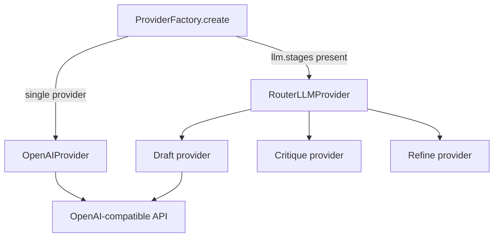

# LLM Layer

## Purpose

Abstracts LLM inference behind a stable protocol, supports multi-provider routing
per reflection stage, handles retries and timeouts, and emits structured responses
for telemetry.

## Invariants

- Custom `LLMProvider` protocol; no LangChain dependency.
- Secrets from environment; `api_key` in yaml for local-only setups.
- Retries on transient failures (5xx, rate limit); not on 4xx auth errors.
- `model_context_limit` and `max_tokens` are separate concerns.

## Configuration

| Key | Default | Description |
|-----|---------|-------------|
| `llm.provider` | `openai` | Factory adapter name |
| `llm.model` | `local-model` | Base model |
| `llm.base_url` | `http://localhost:1234/v1` | API endpoint |
| `llm.draft_model` / `critique_model` / `refine_model` | `""` | Fallback to `model` |
| `llm.stages` | (optional) | Per-stage `{provider, model, base_url, ...}` |
| `llm.reflection_enabled` | `true` | Enable D→C→R in provider |
| `llm.timeout` | `600.0` | Request timeout |
| `llm.draft_empty_retries` | `1` | Draft attempts on empty LLM output before segment `error` |
| `llm.retry.max_attempts` | `3` | Tenacity attempts |
| `llm.model_context_limit` | `8192` | Input budget for context resolver |
| `llm.max_tokens` | `8192` | Output token cap |

## Data flow

## Behavior

### Provider protocol

`LLMProvider` defines `generate_draft`, `generate_critique`, `generate_refine`,
`stage_model_name`, `get_prompt_version`, and `translate_segment_iter`. Returns
`LLMResponse` with `text`, `duration_ms`, token counts, optional `bypass` flag.

`stage_model_name(stage)` resolves the model identifier for telemetry and artifact
metadata uniformly across single-model and router providers (no `isinstance` checks
in the translation engine).

`translate_segment_iter` is a **thin adapter** over
`llm/reflection_pass.py` for the sequential execution path; it delegates to
`run_reflection_pass` and yields `status` / `result` events without persisting
workflow artifacts.

### Two routing patterns

1. **`llm.stages`** — `ProviderFactory` builds `RouterLLMProvider` delegating draft,
   critique, refine to distinct provider instances (hybrid local + cloud).
2. **Per-stage model fields** — single `OpenAIProvider` with `draft_model`,
   `critique_model`, `refine_model` overrides.

### Reflective workflow (canonical semantics)

Stage orchestration lives in `llm/reflection_pass.py`. Providers expose
the three `generate_*` primitives; strategies and `translate_segment_iter` call
`reflection_pass` rather than duplicating short-circuit and retry logic.

When `reflection_enabled`:

1. Draft with context and `temperature`.
2. Critique with `reflection_temperature` (default 0.0).
3. Refine unless critique JSON sets `requires_refine: false`.

`CritiqueParser` extracts JSON from fenced blocks or raw output. Both workflow and
sequential modes use `REFINE_MAX_VALIDATION_RETRIES` (default 3) for refine
validation retries via the shared `run_refine` implementation.

### Retry policy

`tenacity` exponential backoff between `min_wait_seconds` and `max_wait_seconds`.
Configurable via `llm.retry.max_attempts`. Exhausted retries surface as segment `error`.

### Context budgeting

`tiktoken` estimates prompt size. `ContextResolver` alternates truncation when
context exceeds `model_context_limit - max_tokens`.

## Decisions

| Decision | Rationale | Rejected alternative |
|----------|-----------|---------------------|
| Custom protocol | Minimal deps, full control | LangChain chains |
| Router for `llm.stages` | Hybrid GPU/cloud without pipeline changes | Multiple CLI invocations |
| Tenacity retries | Battle-tested backoff | Manual retry loops |
| Separate context vs output limits | Accurate RAG budgeting | Single token field |
| OpenAI-compatible first | LM Studio, Ollama, OpenRouter | Provider-specific SDKs only |

## Implementation map

| Module / class | Responsibility |
|----------------|----------------|
| `llm/provider.py` | `LLMProvider` protocol, `LLMResponse`, `stage_model_name` |
| `llm/openai_provider.py` | OpenAI-compatible client |
| `llm/router_provider.py` | Stage delegation and per-stage model resolution |
| `llm/factory.py` | `ProviderFactory.create` |
| `llm/base_provider.py` | `stage_model_name` default, `translate_segment_iter` adapter |
| `llm/critique_parser.py` | Critique JSON parsing |
| `llm/reflection_pass.py` | Canonical D→C→R stage semantics |
| `telemetry/service.py` | `record_inference_from_llm` |

## Failure modes

| Condition | Effect | Recovery |
|-----------|--------|----------|
| ReadTimeout | `error` status | Increase `timeout` |
| RateLimitError | Retry then `error` | Backoff / different provider |
| 401 / auth | No retry, `error` | Fix API key |
| Context overflow | Truncated neighbors | Reduce `context_window` |

## Known gaps

- Only `openai` provider adapter registered in factory today.

## Open / deferred

- Additional first-class providers beyond OpenAI-compatible.
