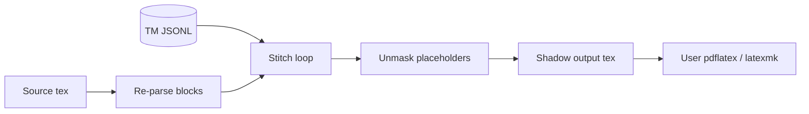

# Build and Output

## Purpose

Reconstructs compilable `.tex` files from the Translation Memory.

## Invariants

- Build uses **re-parse + stitch**; TM does not store full document text.
- Default build is **fail-closed**: non-buildable or missing translations raise `BuildError`.
- With `--allow-partial`, skipped segments emit original `raw_text` and are reported as `BuildSkip`.
- Persisted placeholder map from TM is the build contract (not live re-parse map).

## Configuration

| Key | Description |
|-----|-------------|
| `project.injections` | LaTeX package lines injected after `\documentclass` |

CLI: `lilt pipeline build … [--allow-partial]` — see [CLI reference](../reference/cli.md).

## Data flow



## Behavior

### Buildable statuses

`SegmentPolicy.BUILDABLE_STATUSES`: `refined`, `reviewed`, `approved`, `locked` (must also have a non-empty `translation`).

Non-buildable for stitch purposes: `generated`, `drafted`, `critiqued`, `conflict`, `error` (plus missing TM row / missing translation).

### Build algorithm

```text
1. PARSE   — Re-parse source → ordered SegmentBlock list
2. LOAD    — Load TM namespace → Dict[id, StoredSegment]
3. STITCH  — For each translatable block in document order:
               a. Match StoredSegment by block.id
               b. If status in BUILDABLE_STATUSES AND translation present:
                    if source_hash drifted → BuildError (re-sync)
                    unmask(translation) + whitespace shadowing
               c. Else: record BuildSkip (status / missing translation / not in TM)
                    emit block.raw_text for that slot (only used if allow_partial)
4. GATE    — If any BuildSkip and not allow_partial → BuildError
5. CONCAT  — Join segments
6. WRITE   — Output file (+ preamble injections)
```

### Whitespace shadowing

Leading/trailing whitespace from `raw_text` is preserved around unmasked
translation to prevent LaTeX comment swallowing (e.g. lost `\n\n` after blocks).

### Persisted placeholder contract

Build unmasks using `StoredSegment.placeholders` saved at sync time.
`BuildValidator` compares persisted mapping against current re-parse mapping;
mismatch raises `ValidationError` — re-sync required. An empty persisted map
with a non-empty fresh parse is drift (not a soft bypass). Empty-map prechecks
use the case-insensitive placeholder contract regex.

### Preamble injections

`project.injections` inserted after `\documentclass{...}` for target-language
packages (e.g. `babel`, `xeCJK`) so output compiles without manual patching.

### Partial builds

`--allow-partial` opts into source fallback for skipped segments. The CLI prints
a warning listing skipped segment IDs. Without the flag, operators must
re-translate or resolve conflicts first.

## Decisions

| Decision | Rationale | Rejected alternative |
|----------|-----------|---------------------|
| Re-parse + stitch | No TM duplication; source is structure authority | Store full doc in TM |
| Persisted placeholders | Reproducible historical builds | Always use live parser map |
| Injection hooks | Target-locale compile without hand-editing | Manual preamble edits |
| Fail-closed default | Incomplete localization must not look like a successful build | Soft-fallback always |
| `--allow-partial` opt-in | Explicit escape hatch for WIP documents | Silent source bleed |

## Implementation map

| Module / class | Responsibility |
|----------------|----------------|
| `core/build.py` | Stitch, `BuildSkip` / `BuildResult`, fail-closed gate, whitespace, injections |
| `models/segment_policy.py` | `BUILDABLE_STATUSES` |
| `validation/validators.py` | `BuildValidator` |
| `services/pipeline_service.py` | `build` orchestration (`allow_partial`) |
| `services/pdf_compile.py` | `PdfCompileService` — `compile_pdf` service-only helper |
| `cli/commands/pipeline.py` | `build` command + `--allow-partial` |

## Failure modes

| Condition | Effect | Recovery |
|-----------|--------|----------|
| Placeholder drift | `BuildValidator` / `BuildError` | `pipeline sync` |
| Source hash drift on buildable segment | `BuildError` | `pipeline sync` then rebuild |
| Missing / non-buildable translation (default) | `BuildError` listing skips | Translate / resolve; or `--allow-partial` |
| Missing / non-buildable with `--allow-partial` | Source text in output + warning | Finish translation later |
| Parser roundtrip failure | `parse_file` raises on stitch mismatch | Fix source; see [03-parser-masking](03-parser-masking.md) |

## Known gaps

None for gap-preserving roundtrip; see `parser/roundtrip.py` and `tests/test_parser_roundtrip.py`.

## Open / deferred

- Broader fixture coverage beyond `unix.tex`.
- CLI exposure of `compile_pdf` (users compile manually after `pipeline build`).
