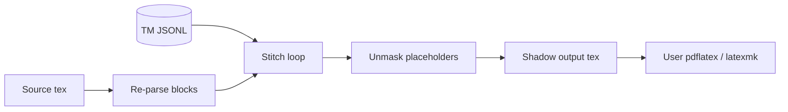

# Build and Output

## Purpose

Reconstructs compilable `.tex` files from the Translation Memory.

## Invariants

- Build uses **re-parse + stitch**; TM does not store full document text.
- Untranslated or `conflict` segments keep original `raw_text`.
- Persisted placeholder map from TM is the build contract (not live re-parse map).

## Configuration

| Key | Description |
|-----|-------------|
| `project.injections` | LaTeX package lines injected after `\documentclass` |

## Data flow



## Behavior

### Build algorithm

```text
1. PARSE   — Re-parse source → ordered SegmentBlock list
2. LOAD    — Load TM namespace → Dict[id, StoredSegment]
3. STITCH  — For each block in document order:
               a. Match StoredSegment by block.id
               b. If translation present AND status in {refined, reviewed, approved, locked}:
                    unmask(translation) + whitespace shadowing
               c. Else: output block.raw_text unchanged
4. CONCAT  — Join segments
5. WRITE   — Output file (+ preamble injections)
```

### Whitespace shadowing

Leading/trailing whitespace from `raw_text` is preserved around unmasked
translation to prevent LaTeX comment swallowing (e.g. lost `\n\n` after blocks).

### Persisted placeholder contract

Build unmasks using `StoredSegment.placeholders` saved at sync time.
`BuildValidator` compares persisted mapping against current re-parse mapping;
mismatch raises `ValidationError` — re-sync required.

### Preamble injections

`project.injections` inserted after `\documentclass{...}` for target-language
packages (e.g. `babel`, `xeCJK`) so output compiles without manual patching.


### Conflict segments at build

Segments in `conflict` keep source language text; build warns but does not fail.

## Decisions

| Decision | Rationale | Rejected alternative |
|----------|-----------|---------------------|
| Re-parse + stitch | No TM duplication; source is structure authority | Store full doc in TM |
| Persisted placeholders | Reproducible historical builds | Always use live parser map |
| Injection hooks | Target-locale compile without hand-editing | Manual preamble edits |

## Implementation map

| Module / class | Responsibility |
|----------------|----------------|
| `core/build.py` | Stitch, whitespace shadowing, injections |
| `validation/validators.py` | `BuildValidator` |
| `services/pipeline_service.py` | `build` orchestration; `compile_pdf` service-only helper |
| `cli/commands/pipeline.py` | `build` command |

## Failure modes

| Condition | Effect | Recovery |
|-----------|--------|----------|
| Placeholder drift | `BuildValidator` error | `pipeline sync` |
| Missing translation | Source segment in output | Translate segment |
| Parser roundtrip failure | `parse_file` raises on stitch mismatch | Fix source; see [03-parser-masking](03-parser-masking.md) |

## Known gaps

None for gap-preserving roundtrip; see `parser/roundtrip.py` and `tests/test_parser_roundtrip.py`.

## Open / deferred

- Broader fixture coverage beyond `unix.tex`.
- CLI exposure of `compile_pdf` (users compile manually after `pipeline build`).
