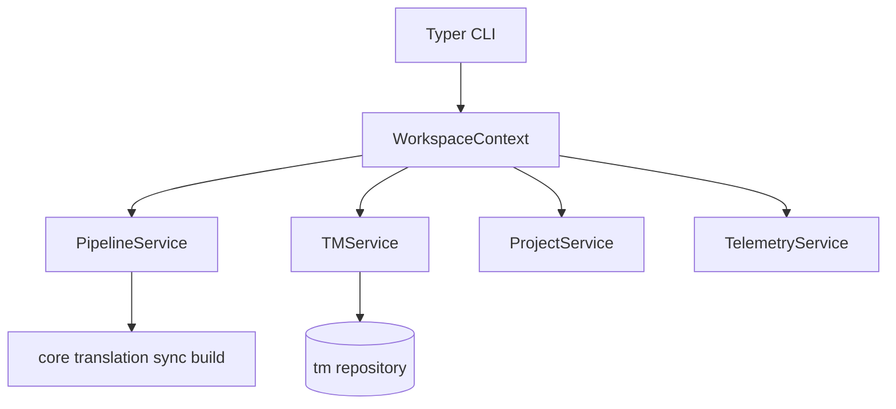

# CLI and Application Layer

## Purpose

Exposes LILT as a Typer CLI with a clean architecture boundary: commands delegate
to services, services orchestrate core domain logic.

**User-facing command tables:** [docs/reference/cli.md](../reference/cli.md).
This guide covers services, invariants, and application-layer behavior.

## Invariants

- CLI → Services → Core/TM/Parser/LLM (no business logic in command handlers).
- `WorkspaceContext` is the composition root.
- Domain exceptions map to user-facing messages via `lilt.exceptions`.
- Path arguments sandboxed to workspace via `WorkspaceContext.resolve_under_workspace()`.

## Configuration

Global CLI options:

| Flag | Description |
|------|-------------|
| `-C, --work-dir` | Run as if started in given directory |
| `--debug` | Verbose logging to `.lilt/lilt.log` |
| `--version` | Print installed package version (`latex-lilt`) and exit |

## Data flow

## Behavior

### Command surface

Full flags and examples: [docs/reference/cli.md](../reference/cli.md).

Namespace is derived from the input `.tex` path during `sync` via `derive_namespace()`
(root files: `chapter1.tex` → `chapter1`; nested: `chapters/intro.tex` →
`chapters__intro`). See [02-persistence](02-persistence.md).

PDF compilation is **not** a CLI command. `PdfCompileService` (via
`PipelineService.compile_pdf`) exists for library/service use; users compile with
`pdflatex` / `latexmk` after `pipeline build`.

### Editor integration

`pipeline edit` and interactive `review` use `click.edit()` with `$EDITOR`:

- Temp file extension **`.txt`** (not `.tex`).
- Marker `# --- DO NOT EDIT BELOW THIS LINE ---` separates translation from source context.
- On save: translation above marker → `PipelineService.submit_human_translation`
  → `SegmentTranslationValidator` → `approved` status on success.
- On validation failure: error message shown; TM unchanged.

### Service layer

| Service | Responsibility |
|---------|----------------|
| `ProjectService` | Init, config load/save, configure / dry-run analyze |
| `PipelineService` | Sync, translate, build, review, edit |
| `PdfCompileService` | Service-only `pdflatex`/bib compilation helper |
| `TMService` | List, search, export, import, stats, `context_budget` (`tm budget`), prune |
| `WorkspaceContext` | Wire config path, TM repo, lazy `TelemetryService` |

## Decisions

| Decision | Rationale | Rejected alternative |
|----------|-----------|---------------------|
| Typer | Type-hint CLI, concise subcommands | argparse, raw Click |
| Service layer | Testable orchestration, thin CLI | Fat command handlers |
| `click.edit()` for edits | Native multi-line, user editor choice | `textual` full TUI |
| Consolidated `configure --dry-run` / `tm list` flags | Fewer top-level verbs after M4 | Separate `analyze` / `search` / `show` / `stats` |
| User-facing CLI tables in `docs/reference/cli.md` | Single operator SSOT; this guide keeps services/invariants | Duplicate tables in README / L1 |

## Implementation map

| Module / class | Responsibility |
|----------------|----------------|
| `cli/main.py` | App entry, global options, subcommand registration |
| `cli/commands/*.py` | Command adapters |
| `cli/ui.py` | Rich tables, panels, messages |
| `services/workspace_context.py` | Dependency composition (TM + telemetry) |
| `services/pipeline_service.py` | Pipeline orchestration |
| `services/pdf_compile.py` | `PdfCompileService` (service-only TeX compile) |
| `services/tm_service.py` | TM query/mutate operations |
| `tm/segment_lookup.py` | Segment ID prefix resolution |
| `lilt/exceptions.py` | Typed domain errors |

## Failure modes

| Condition | CLI behavior |
|-----------|--------------|
| `ProjectNotInitializedError` | Message + exit 1 |
| `SegmentNotFoundError` | Message + exit 1 |
| `BuildError` (includes wrapped build validation) | Error panel + exit 1 |
| User aborts editor | No TM change |
| Corrupt namespace on search | Warning + suggestion to run `tm admin repair` |
| `NamespaceBusyError` | Message + exit 1 (includes holder pid/host when known); retry when the other operation finishes; stale same-host lease auto-reclaimed |
| `KeyboardInterrupt` during translate | Exit 130 after cooperative abort between segments; completed progress kept |

## Known gaps

- Editor uses `.txt` extension; early design specified `.tex`.

## Open / deferred

- HTTP API (e.g. FastAPI) not implemented; service layer structured for future extraction.
- Optional TUI for high-volume review.
- Expose `compile_pdf` as a CLI command (currently service-only).
