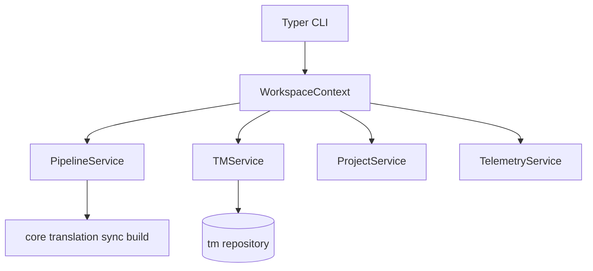

# CLI and Application Layer

## Purpose

Exposes LILT as a Typer CLI with a clean architecture boundary: commands delegate
to services, services orchestrate core domain logic. Canonical command reference
for the entire project.

## Invariants

- CLI → Services → Core/TM/Parser/LLM (no business logic in command handlers).
- `WorkspaceContext` is the composition root.
- Domain exceptions map to user-facing messages via `lilt.exceptions`.
- Path arguments sandboxed to workspace via `PipelineService`.

## Configuration

Global CLI options:

| Flag | Description |
|------|-------------|
| `-C, --work-dir` | Run as if started in given directory |
| `--debug` | Verbose logging to `.lilt/lilt.log` |

## Data flow

## Behavior

### Command reference

#### `lilt project`

| Command | Description |
|---------|-------------|
| `init` | Create `.lilt/`, default `lilt.yaml`, TM directory |
| `configure <path>` | Write `custom_macros` (+ optional `--include-aliases`); `--dry-run` for analyze-only |

#### `lilt pipeline`

Namespace is derived from the input `.tex` path during `sync` via `derive_namespace()` (root files: `chapter1.tex` → `chapter1`; nested: `chapters/intro.tex` → `chapters__intro`). See [02-persistence](02-persistence.md).

| Command | Description |
|---------|-------------|
| `sync <input_file.tex>` | Parse file (+ dependency graph) and update TM |
| `translate [namespace]` | Run translation pipeline (`--all` for every namespace) |
| `build <namespace> <input.tex> <output.tex>` | Reconstruct translated document |
| `review <namespace>` | Interactive review queue |
| `edit <namespace> <segment_id>` | Open segment in `$EDITOR` |

**`translate` flags:** `--force`, `--all`, `--id` (prefix match), `--status`
(aliases via `StatusResolver`), `--stage` (workflow only), `--mode workflow|sequential`.

PDF compilation is **not** a CLI command. `PipelineService.compile_pdf` exists for
library/service use; users compile with `pdflatex` / `latexmk` after `pipeline build`.

#### `lilt tm`

| Command | Description |
|---------|-------------|
| `list [namespace]` | List namespaces (no args), segments, `--search`, or `--id` inspect |
| `status [namespace]` | Token and cost summary (`--all` for consolidated) |
| `set-status <namespace> <id> <status>` | Manual status (incl. `locked`) |
| `export <namespace> <file>` | Export CSV/JSON |
| `import <namespace> <file>` | Import CSV/JSON |
| `admin prune <namespace>` | Remove `deprecated` segments |
| `admin reset <namespace>` | Reset machine-translated segments to `generated` (`--force` includes human-reviewed) |
| `admin repair <namespace>` | Skip corrupt JSONL lines, backup original file, compact namespace |

#### `lilt telemetry`

| Command | Description |
|---------|-------------|
| `show` | Inference summary and per-stage breakdown |

### Editor integration

`pipeline edit` and interactive `review` use `click.edit()` with `$EDITOR`:

- Temp file extension **`.txt`** (not `.tex`).
- Marker `# --- DO NOT EDIT BELOW THIS LINE ---` separates translation from source context.
- On save: translation above marker → `PipelineService.submit_human_translation`
  → `SegmentTranslationValidator` → `approved` status on success.
- On validation failure: error message shown; TM unchanged.

### Service layer

| Service | Responsibility |
|---------|----------------|
| `ProjectService` | Init, config load/save, configure / dry-run analyze |
| `PipelineService` | Sync, translate, build, review, edit; `compile_pdf` service-only |
| `TMService` | List, search, export, import, stats, prune |
| `WorkspaceContext` | Wire config path, TM repo, lazy `TelemetryService` |

## Decisions

| Decision | Rationale | Rejected alternative |
|----------|-----------|---------------------|
| Typer | Type-hint CLI, concise subcommands | argparse, raw Click |
| Service layer | Testable orchestration, thin CLI | Fat command handlers |
| `click.edit()` for edits | Native multi-line, user editor choice | `textual` full TUI |
| Consolidated `configure --dry-run` / `tm list` flags | Fewer top-level verbs after M4 | Separate `analyze` / `search` / `show` / `stats` |
| Canonical command table here | Single source; README links here | Duplicate tables in README |

## Implementation map

| Module / class | Responsibility |
|----------------|----------------|
| `cli/main.py` | App entry, global options, subcommand registration |
| `cli/commands/*.py` | Command adapters |
| `cli/ui.py` | Rich tables, panels, messages |
| `services/workspace_context.py` | Dependency composition (TM + telemetry) |
| `services/pipeline_service.py` | Pipeline orchestration |
| `services/tm_service.py` | TM query/mutate operations |
| `tm/segment_lookup.py` | Segment ID prefix resolution |
| `lilt/exceptions.py` | Typed domain errors |

## Failure modes

| Condition | CLI behavior |
|-----------|--------------|
| `ProjectNotInitializedError` | Message + exit 1 |
| `SegmentNotFoundError` | Message + exit 1 |
| `ValidationError` on build | Error panel + exit 1 |
| User aborts editor | No TM change |
| Corrupt namespace on search | Warning + suggestion to run `tm admin repair` |
| `NamespaceBusyError` | Message + exit 1; retry when the other operation finishes |

## TM maintenance commands

| Command | Purpose |
|---------|---------|
| `tm set-status` | Explicit lifecycle change; `--force` allows reset to `GENERATED` (clears translation and LLM artifacts) |
| `tm admin reset` | Batch reset of machine/human-reviewed segments to `GENERATED` |
| `tm admin repair` | Skip corrupt JSONL lines, backup original file, compact namespace |

## Known gaps

- Editor uses `.txt` extension; early design specified `.tex`.

## Open / deferred

- HTTP API (e.g. FastAPI) not implemented; service layer structured for future extraction.
- Optional TUI for high-volume review.
- Expose `compile_pdf` as a CLI command (currently service-only).
