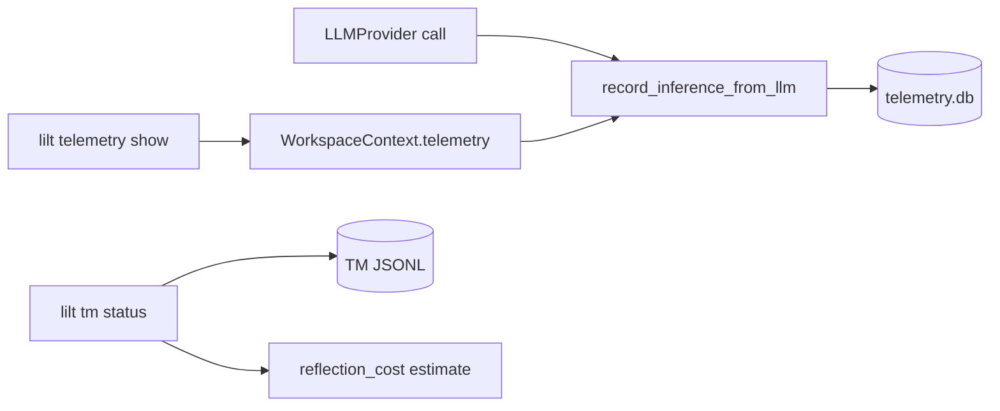

# Observability

## Purpose

Records per-inference telemetry locally and exposes token/cost summaries for
FinOps tuning and pipeline debugging.

## Invariants

- Telemetry is local-only (SQLite); no external APM in MVP.
- Every LLM provider call should record an `inference_records` row when telemetry is enabled.
- `error` vs `conflict` segment statuses remain authoritative in TM JSONL, not telemetry.

## Configuration

| Key | Default | Description |
|-----|---------|-------------|
| `llm.token_price_per_million` | `5.0` | Rough USD estimate in `tm status` |

## Data flow

## Behavior

### SQLite schema

Database: `.lilt/telemetry.db`, managed by `TelemetryService` (lazy singleton on `WorkspaceContext`).

**Table `inference_records`:** per call — `segment_id`, `namespace`, `provider`,
`model`, `stage`, token counts, duration, `is_heuristic_simple` (bypass flag).

**Views:** `stage_metrics`, `workflow_metrics` (exposed in `lilt telemetry show` as Workflow Summary).

### Recording

`TelemetryService.record_inference_from_llm()` called after provider responses
from `core/translation/` strategies (`PipelineService` injects `ctx.telemetry`).

### CLI

- `lilt telemetry show` — global summary, per-stage breakdown, workflow summary (`--namespace` filter).
- `lilt tm status <namespace>` — source token count + simple price estimate from
  `token_price_per_million` × source tokens.

### Reflection cost estimation

Pre-flight formula for expected D→C→R token cost across context injection:

$$\text{Tokens}_{estimated} = \left[ N \times S_{prompt} \times (2 + R_{ratio}) \right] + \left[ \text{Tokens}_{source} \times \left( 1.2 \times C_{avg} \times (2 + R_{ratio}) + 2.4 \right) \right]$$

Where $N$ = translatable segments, $S_{prompt} \approx 600$, $R_{ratio} \approx 0.7$,
$C_{avg}$ from `context_window`.

Implemented in `telemetry/reflection_cost.py` and exposed via `TMService.get_stats()` as
`tokens_reflection_estimate` (shown in `lilt tm status` as **Reflection Cost Estimate**).

## Decisions

| Decision | Rationale | Rejected alternative |
|----------|-----------|---------------------|
| Local SQLite | Offline FinOps, no cloud dependency | External observability SaaS |
| Per-stage records | Debug workflow vs sequential costs | Aggregate-only counters |
| TM + telemetry split | TM = editorial truth; telemetry = inference log | Store tokens only in TM |
| Reflection cost vocabulary | Aligns with reflection pipeline (no agents) | Revive "agential" term |

## Implementation map

| Module / class | Responsibility |
|----------------|----------------|
| `telemetry/service.py` | DB init, record, query |
| `services/workspace_context.py` | Lazy `TelemetryService` per workspace |
| `cli/commands/telemetry.py` | `show` command |
| `services/tm_service.py` | `get_stats` token aggregation |
| `core/translation/base_strategy.py` | `_record_telemetry` hooks |
| `telemetry/reflection_cost.py` | Pre-flight token estimate for `tm status` |

## Failure modes

| Condition | Effect |
|-----------|--------|
| Missing telemetry.db | Created on first record |
| DB locked | Rare; single-user CLI assumed |

## Known gaps

- Reconcile TM token sums vs telemetry DB in stats output.

## Open / deferred

- Deeper FinOps dashboards beyond CLI tables.
