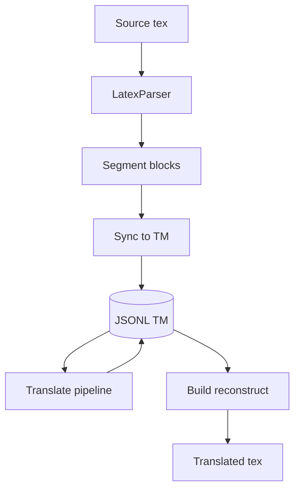
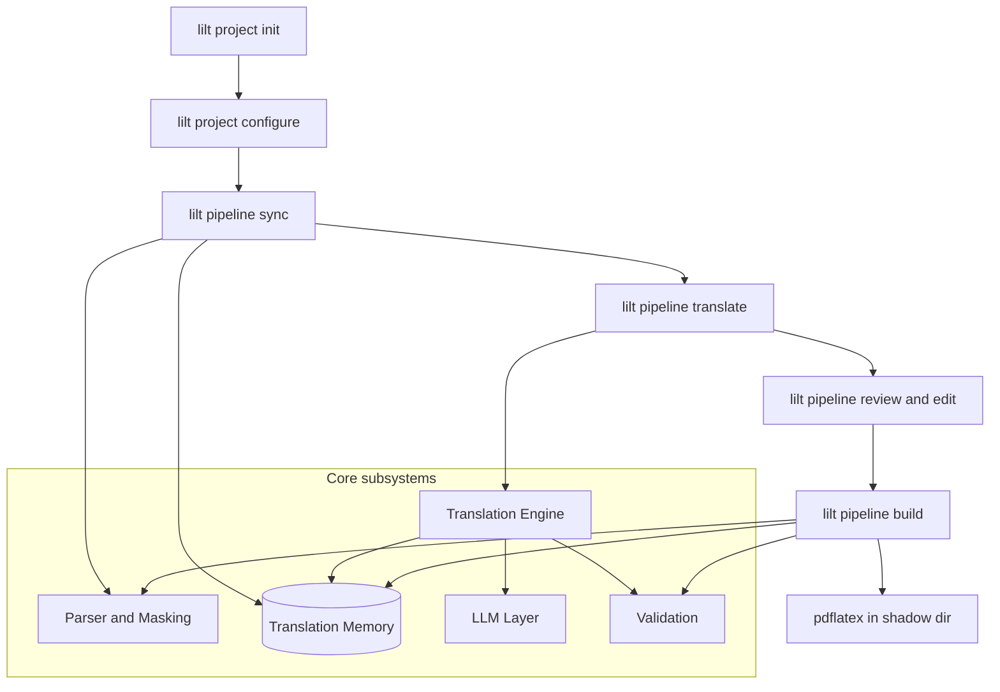

# LILT Architecture

LILT (LaTeX Intelligent Localization Tool) is a CLI for continuous localization of
academic LaTeX projects. It extracts translatable segments from `.tex` sources,
persists them in a Translation Memory (TM), runs an LLM reflection pipeline
(draft, critique, refine), and reconstructs translated documents for compilation.

Product requirements: [Product Context](00-product-context.md).
Documentation hub (guides, reference, runbooks): [docs/README.md](../README.md).
Landing page: [README](../../README.md).

## Product boundary

This repository ships the **localization engine** (CLI, parser, TM, LLM reflection, build) and its unit/CLI tests.

| In this repo | Outside this repo |
|--------------|-------------------|
| `src/lilt/`, `tests/`, L1 architecture docs | Curated validation corpora, evaluation harnesses, campaign artifacts |
| `make ci` (format, lint, typecheck, pytest) | Empirical PDF campaigns and nightly eval pipelines |

Keep generated evaluation workspaces and third-party paper downloads out of this tree; see [CONTRIBUTING.md](../../CONTRIBUTING.md).

## Reading order

| Guide | Domain | Start here if you need to understand... |
|-------|--------|----------------------------------------|
| [00-glossary](00-glossary.md) | Canonical domain language | Official vocabulary, synonyms, and disambiguation |
| [00-product-context](00-product-context.md) | Product intent (PRD) | Goals, personas, roadmap; distinguish shipped vs [deferred](appendix-deferred.md) |
| [01-platform](01-platform.md) | Configuration and workspace layout | `lilt.yaml`, `.lilt/` directory, storage formats |
| [02-persistence](02-persistence.md) | Translation Memory | Segment schema, lifecycle, identity, JSONL I/O |
| [03-parser-masking](03-parser-masking.md) | Parser and masking | AST parsing, placeholders, linguistic bypass |
| [04-translation-engine](04-translation-engine.md) | Translation pipeline | Workflow vs sequential, reflection, validation |
| [05-llm-layer](05-llm-layer.md) | LLM providers | Routing, retry, prompts, telemetry hooks |
| [06-build-output](06-build-output.md) | Build and output | Document reconstruction, shadow directory |
| [07-cli-application](07-cli-application.md) | CLI and services | Commands, services, editor integration |
| [08-observability](08-observability.md) | Telemetry and cost | SQLite records, stats, cost estimation |
| [appendix-deferred](appendix-deferred.md) | Future work | Plugins, validators Phase 3, git automation |

## Pipeline cheat sheet

```text
lilt project init
lilt project configure [--dry-run]
lilt pipeline sync <input.tex>
lilt pipeline translate [namespace] [--all] [--mode workflow|sequential]
lilt pipeline build <namespace> <input.tex> <output.tex>
```

Human review loop: `lilt pipeline review` then `lilt pipeline edit`.

## Domain model (core concepts)

| Concept | Description | Primary modules |
|---------|-------------|-----------------|
| **Segment** | Atomic translatable unit with stable ID, masked `source_text`, `translation`, `status` | `models/segment.py`, `tm/repository.py` |
| **Namespace** | TM partition from encoded relative `.tex` path (e.g. `main.jsonl`, `chapters__intro.jsonl`) | `tm/namespace.py`, `tm/repository.py` |
| **Translation Memory** | Append-only JSONL per namespace under `.lilt/tm/` | `tm/repository.py` |
| **Placeholder map** | Persisted mask tokens (`<ref>`, `<macro>`, etc.) for build-time unmask | `parser/placeholder_engine.py`, `StoredSegment.placeholders` |
| **Reflection artifact** | Intermediate `draft` / `critique` / `refined` text (workflow mode) | `core/translation/` |
| **Workspace** | Project root with `.lilt/lilt.yaml`, TM, telemetry DB | `services/workspace_context.py` |



Operator CLI flow (init → configure → sync → translate → review → build):



## Where in code

```text
src/lilt/
  cli/           Typer commands (project, pipeline, tm, telemetry)
  services/      Application layer (WorkspaceContext, *Service)
  core/          Domain orchestration (sync, translate, build, policies)
  parser/        AST parse, mask, dependency analysis
  tm/            JSONL repository, identity, source-change policy
  llm/           Providers, router, prompts, critique parser
  validation/    SegmentTranslationValidator, PlaceholderValidator, SyntaxValidator, BuildValidator
  telemetry/     SQLite inference records
  models/        Pydantic domain models
```

## Documentation conventions

Each L1 guide uses the same section order: Purpose, Invariants, Configuration,
Data flow, Behavior, Decisions, Implementation map, Failure modes, Known gaps,
Open / deferred.

When code and documentation disagree, **Behavior** and **Known gaps** reflect
the running implementation. **Open / deferred** tracks intentional roadmap items.

**Mermaid diagrams:** use `stateDiagram-v2` for lifecycles; use `flowchart` with
bracket nodes `["step"]` for processes and cylinders `[(store)]` for persistence
(JSONL, SQLite, files). Subgraph titles use `subgraph id [Title]` without quotes.

## Terminology

| Term | Meaning in LILT |
|------|-----------------|
| **Product Phase N** | Product roadmap milestone in [Product Context](00-product-context.md) |
| **Validator Phase 3** | Future `TerminologyValidator`, `StructureValidator` ([appendix-deferred](appendix-deferred.md)) |
| **Identity Phase 2** | AST-node diffing with stable IDs across structural moves (deferred) |
| **Shipped** | Implemented in code; documented in L1 guides and PRD "Shipped" section |

## Documentation update policy

1. Behavior changes in `src/lilt/` must update the relevant L1 guide in the same change set.
2. When a feature ships, remove it from [appendix-deferred](appendix-deferred.md) and add it to PRD "Shipped" if user-visible.
3. **Known gaps** lists only open issues; remove items when resolved (do not keep as historical notes).
4. Architectural decisions live in each L1 guide's **Decisions** section and in [appendix-deferred](appendix-deferred.md); do not maintain separate ADR IDs.
